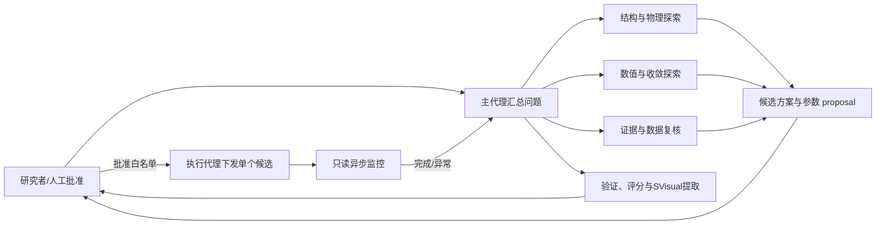

# Trench 与 SGT VDMOS 总剂量辐照效应对比及 TCAD 建模验证

> 文档用途：本文件是后续 PPT 制作的逐页内容规格，不是最终演示稿。每页分别给出页面文字、口头讲稿、图片与布局要求、证据来源及制作备注。
>
> 固定口径：`T = Trench VDMOS`，`S = SGT VDMOS`。该对应关系来自研究者确认；具体结构差异与物理机制仍须由器件结构图、TCAD 模型或公开文献支持，不能只根据电学曲线反推。
>
> 制作基础：在 `E:\仿真数据处理\codexppt\dist\S_T_VDMOS_TID_完整成果展示版_讲稿版.pptx` 基础上修改。凡注明“保留原 PPT”的页面，优先沿用原页布局和图片，不重新绘制。综合文字与数字参考 `E:\仿真数据处理\report\ST_TID_综合成果报告\ST_TID_综合成果报告.docx`。

## 证据标签

- `实验事实`：由本项目原始测量或统一处理结果直接支持。
- `仿真结果`：由正式 TCAD deck、求解日志、曲线和验证记录支持。
- `文献结论`：来自所列论文，不能直接等同于本批器件结论。
- `合理解释`：与实验、仿真及文献相容，但尚未完成唯一机制验证。
- `用户确认`：器件类型、汇报范围或研究过程由研究者确认。
- `未完成/受限`：当前材料不足以支持正向结论，制作时必须保留限制。

---

# 第一部分 研究背景、文献与实验方法

## 第 1 页｜封面

### 页面标题

**Trench 与 SGT VDMOS 总剂量辐照效应对比及 TCAD 建模验证**

### 核心结论

本研究通过六只器件的七剂量纵向实验，比较 Trench 与 SGT VDMOS 的总剂量辐照响应，并进一步建立剂量相关 TCAD 模型，对实验趋势及模型适用边界进行验证。

### PPT 页面文字

- ^60Co γ 射线总电离剂量实验
- S1-S3、T1-T3 六只器件，0-60 krad(Si)
- 转移特性、关断输出特性与统一参数提取
- Trench 与 SGT VDMOS 的剂量相关 TCAD 建模

页面只放标题、姓名/专业/导师/日期等答辩信息，不放长段落。

### 口头讲稿

各位老师好，我汇报的题目是《Trench 与 SGT VDMOS 总剂量辐照效应对比及 TCAD 建模验证》。本研究围绕两类纵向功率 MOS 器件展开：T 组为传统沟槽型 Trench VDMOS，S 组为分裂栅沟槽型 SGT VDMOS。实验部分持续跟踪六只器件在 0 到 60 krad(Si) 七个剂量点下的转移特性和关断输出特性；数据处理部分采用统一算法重新提取阈值电压、跨导和亚阈值摆幅；仿真部分则尝试把剂量相关陷阱参数引入 TCAD 模型，检验模型能够解释哪些实验趋势、还存在哪些残差和限制。整套工作的重点不是只展示拟合较好的曲线，而是建立一条从实验现象、参数提取到模型验证的完整证据链。

### 图表与布局要求

- 保留现有 PPT 的蓝橙工业风格。
- 封面主视觉建议使用一张 Trench/SGT 结构对照图或两种器件的 SVisual 结构拼图。
- 不在封面堆叠实验曲线和指标数字。

### 来源与证据

- `用户确认`：T=Trench VDMOS，S=SGT VDMOS；最终范围覆盖两种器件的 TCAD 建模。
- `实验事实`：综合成果报告摘要与第 1 章。
- `制作来源`：原讲稿版 PPT 封面与模板。

### 制作备注

两类器件的 TCAD 结果均按统一口径组织；若后续补充新的仿真指标，只需在对应结果页更新图表和结论。

---

## 第 2 页｜高辐射环境会持续改变功率 MOS 器件的关键电学参数

### 核心结论

在航天器、核设施及其他高辐射环境中，电离辐射在氧化层和界面附近引入累积电荷与缺陷，可能造成阈值电压负移、栅控能力下降、漏电变化，严重时使器件偏离正常关断状态。

### PPT 页面文字

电离辐射在材料中产生电子-空穴对。部分空穴在氧化层缺陷处被俘获，并可能伴随界面态增长。对 n 沟道功率 MOS 器件而言，这些变化通常表现为：

1. **阈值电压向负方向移动**：达到反型所需的外加栅压降低；
2. **跨导下降**：栅压对漏极电流的控制能力减弱；
3. **亚阈值摆幅增大**：器件从关断到开启的过渡变缓；
4. **关断输出响应改变**：漏电与高压工作区可能发生变化。

### 口头讲稿

功率 MOS 器件在空间、核设施等环境中工作时，会长期受到电离辐射作用。辐射能量进入氧化层后产生电子和空穴，电子通常较快离开，而一部分迁移较慢的空穴会被氧化层缺陷俘获，形成净正电荷；同时，硅和氧化层界面附近还可能形成或激活界面态。对 n 沟道 MOS 器件而言，正的有效氧化层电荷通常会使阈值电压向负方向移动。当负移足够大时，器件在原本应关断的栅压下仍可能导通，进而带来静态功耗增加、控制失效甚至系统风险。需要说明的是，这里给出的是公开文献支持的通用 TID 机制框架，本实验没有直接测量陷阱谱，因此后续只能说实验现象与该框架相容，不能仅凭电学曲线把不同缺陷成分完全分离。

### 图表与布局要求

- 使用现有配图：`E:\仿真数据处理\答辩\ChatGPT Image 2026年7月23日 15_43_15.png`。
- 建议采用“辐射环境 → 氧化层/界面电荷 → Vth/gm/SS/漏电变化”的横向因果链。
- 图片占页面约 55%，正文控制为 4 个结果卡片。

### 来源与证据

- `文献结论`：Liu et al., 2008；Wang et al., 2023；Wang et al., 2024。
- `合理解释`：本项目尚未通过电荷泵浦、频率扫描或专门退火实验分离氧化层陷阱和界面态贡献。

### 制作备注

避免写成“高剂量、长时间辐照一定使所有器件无法关断”。应写为“可能造成显著负移，严重时影响正常关断”，因为失效程度取决于结构、偏置、剂量和工艺。

---

## 第 3 页｜TCAD 将长周期辐照实验转化为可迭代、可解释的模型研究

### 核心结论

辐照实验给出真实器件发生了什么，TCAD 则在固定结构与物理假设下检验哪些参数能够解释趋势；二者结合可以减少纯经验试错，但仿真不能替代实验标定和证据验证。

### PPT 页面文字

**辐照实验的限制**

- 依赖辐照源、场地与剂量学条件；
- 每个剂量点都需要照射、转运和测试；
- 器件内部电荷、电场和载流子分布难以直接观察；
- 参数耦合明显，仅靠曲线难以区分候选机制。

**TCAD 的作用**

- 在受控条件下改变陷阱、电荷和物理模型参数；
- 观察器件内部电势、电场及载流子分布；
- 对多个剂量点进行统一标定和残差诊断；
- 为后续结构优化与辐射加固提供可复用模型基础。

### 口头讲稿

开展真实辐照实验需要辐照源、固定场地和完整的剂量控制，每增加一个剂量点都要经历照射与电学测试，而且器件内部的电荷分布和电场变化无法仅靠外部端口直接观察。TCAD 的价值，是把候选物理机制写入可控制的器件模型中，在固定结构、温度和求解条件下改变少量参数，再检查多个实验指标能否被同时解释。例如，阈值负移可以通过剂量相关氧化层陷阱电荷描述，但如果同一组参数无法同时解释跨导和亚阈值摆幅，就说明模型仍有缺失。因而，本研究把实验作为主证据，把 TCAD 作为解释和验证工具；仿真可以提高迭代效率、暴露模型边界，但不能跳过实验直接宣布器件的真实辐照规律。

### 图表与布局要求

- 使用现有配图：`E:\仿真数据处理\答辩\ChatGPT Image 2026年7月23日 15_45_34.png`。
- 建议做左右对照：左侧“实验：真实但成本高、内部状态不可见”，右侧“TCAD：可迭代、可观察内部状态，但依赖模型假设”。
- 页面底部增加一句强调：**实验回答“发生了什么”，仿真回答“当前模型能解释到什么程度”。**

### 来源与证据

- `实验事实`：本项目完成六只器件七剂量纵向测试。
- `仿真结果`：T 与 S 器件的七剂量实验-仿真比较及现有证据链。

---

## 第 4 页｜已有研究建立了 TID 机制框架，但结构对比与统一验证仍需具体样品证据

### 核心结论

公开研究已证明沟槽功率 MOSFET 的阈值、漏电和击穿特性会受到 TID 影响，也指出 SGT 与传统 Trench 结构的电场响应可能不同；本项目进一步在同一实验口径下比较两组实际器件，并建立对应 TCAD 模型。

### PPT 页面文字

建议将研究现状画成三层：

1. **通用机制层**：氧化层俘获正电荷和界面态会影响 Vth、gm、SS 与漏电；
2. **结构比较层**：传统 Trench 与 SGT 的沟槽、厚氧化层和漂移区电场设计不同，TID 响应可能存在差异；
3. **本项目落点**：六只器件、七个剂量点、统一算法、实验-仿真对照和可追溯证据链。

**研究缺口：** 文献中的器件结构、辐照偏置、剂量范围和参数提取方法并不完全一致，不能直接替代本批样品的纵向实验和模型标定。

### 口头讲稿

文献已经提供了较清楚的机制背景。早期研究指出，商业沟槽功率 MOSFET 在总剂量辐照后会出现明显阈值漂移，而栅氧化层电荷俘获可以解释相当一部分直流参数退化。近年的研究开始直接比较传统沟槽结构和分裂栅沟槽结构，并使用 TCAD 分析氧化层正电荷如何改变漂移区电场和击穿特性。但这些文献的器件额定值、栅氧厚度、辐照偏置、剂量率和阈值提取方法都不完全相同，因此不能把别人的变化幅度直接移植到本项目。本研究的价值，是在统一实验和统一算法下获得两类器件的连续剂量响应，再以对应器件模型检查这种差异能够被解释到什么程度。

### 图表与布局要求

- 上半部分为“通用机制—结构差异—本项目”的三层研究版图。
- 下半部分用 3 个短句突出本项目：`六器件纵向跟踪`、`同算法参数提取`、`两类器件 TCAD 验证`。
- 不复制论文图，优先自绘研究版图。

### 来源与证据

- `文献结论`：Liu 2008；Wang 2023；Wang 2024。
- `用户确认`：T 与 S 的器件类型对应关系可公开。
- `仿真结果`：T 与 S 两类器件均纳入本项目的 TCAD 实验-仿真比较。

---

## 第 5 页｜三篇 TID 文献分别支撑机制、结构比较与 TCAD 分析

### 核心结论

三篇主线文献形成递进关系：Liu 2008 解释商业沟槽器件的总体 TID 退化，Wang 2023 比较 SGT 与传统 Trench 的结构响应，Wang 2024 进一步分析 SGT 的阈值和击穿退化机制。

### PPT 页面文字

| 文献 | 研究对象与方法 | 主要结论 | 对本项目的作用 |
|---|---|---|---|
| Liu et al., 2008 | 商业沟槽功率 MOSFET，^60Co TID 实验 | 栅氧化层电荷俘获引起 Vth 漂移，并可解释多数辐照后直流参数退化 | 支撑 Vth 负移及直流退化的通用机制框架 |
| Wang et al., 2023 | 100 V SGT-MOS 与传统 T-MOS 对比实验 + Sentaurus | 两类器件 Vth 均呈退化；文中 SGT-MOS 的 BV 对 TID 更敏感，并将差异联系到氧化层正电荷引起的电场重分布 | 支撑两类结构需要分别测试和建模 |
| Wang et al., 2024 | 100 V SGT VDMOS，^60Co 实验 + TCAD | Vth 与 BV 均随剂量和辐照偏置变化；ON-state 辐照下退化更明显 | 支撑 SGT 中陷阱、电场与高压响应耦合的分析框架 |

### 口头讲稿

第一篇是 Liu 等 2008 年对商业沟槽功率 MOSFET 的研究。论文指出，栅氧化层中的电荷俘获导致阈值电压漂移，而阈值漂移又能够解释器件辐照后多数直流参数的退化，这为本项目理解阈值负移提供了基础。第二篇是 Wang 等 2023 年对同为 100 V 的 SGT-MOS 和传统 T-MOS 的实验比较。两类器件的阈值都随 TID 退化，但论文中的 SGT-MOS 击穿电压表现出更强的剂量敏感性，作者使用 Sentaurus 将其与氧化层正电荷引起的电场分布变化联系起来。第三篇是 Wang 等 2024 年对 100 V SGT VDMOS 的进一步研究，结果显示阈值电压和击穿电压都受到剂量与辐照偏置影响，并利用 TCAD 分析其物理原因。这些文献可以作为本项目的机制和方法参考，但不能把文献中的具体器件参数或退化幅度直接当成本批器件的结论。

### 图表与布局要求

- 三列文献卡片或一张四列表格；突出“机制—比较—深入分析”的递进关系。
- 页脚使用完整参考文献信息，正文用 `[1]`、`[2]`、`[3]` 编号。
- Zhu et al., 2026 不放入主文献页；其研究对象为 SiC double-trench MOSFET 的大气中子 SEB，与本项目 ^60Co TID 主线不同。

### 来源与证据

1. S. Liu et al., “Analysis of Commercial Trench Power MOSFETs’ Responses to Co-60 Irradiation,” *IEEE Transactions on Nuclear Science*, 2008.
2. Y. Wang et al., “A Comparative Study on Total Ionizing Dose Effects of 100-V Split-Gate Trench VDMOS and Conventional Trench VDMOS,” ICECCE, 2023.
3. Y. Wang et al., “Analysis of TID Effects on the Threshold Voltage and Breakdown Voltage of 100-V Split-Gate Trench VDMOS,” *IEEE Transactions on Electron Devices*, 2024.

### 制作备注

本页只摘录与本研究直接相关的摘要结论，不逐字复制论文摘要。Wang 2023 和 Wang 2024 的 BV 结果用于说明“结构和偏置会影响高压响应”，不能用于证明本项目 BV 已完成拟合。

---

## 第 6 页｜研究闭环从真实测量延伸到两类器件的可追溯 TCAD 验证

### 核心结论

研究流程依次回答四个问题：辐照后发生了什么、怎样用统一指标比较、哪些趋势能被模型解释、结论能否回到原始证据。

### PPT 页面文字

1. **实验测量**：六只器件、七剂量点、转移与关断输出曲线；
2. **统一处理**：清洗原始工作簿，统一提取 Vth、gm、SS、Id@30 V 与 V@1 µA；
3. **TCAD 建模**：固定器件结构与基础物理模型，建立剂量相关陷阱参数；
4. **实验-仿真比较**：比较曲线、指标和残差，不回避无法同时拟合的部分；
5. **证据审计**：保留 deck、求解日志、曲线、解析 CSV、运行状态和哈希来源。

### 口头讲稿

整个研究不是把实验和仿真分成两段互不相干的工作，而是形成一个闭环。首先通过六只器件的连续剂量实验确认真实变化；随后从原始测量列按统一方法提取参数，避免不同器件使用不同口径；再根据实验趋势建立剂量相关陷阱模型，对 Trench 和 SGT 器件分别开展仿真；最后把仿真曲线与实验曲线进行比较，同时记录拟合较好的指标、仍有明显残差的指标以及求解失败或覆盖不足的情况。所有正式仿真结果都要求能回到实际 deck、PLT、求解日志和解析数据。这样，实验与仿真相互约束，成功和失败都成为可复核的研究证据。

### 图表与布局要求

- 优先使用：`E:\仿真数据处理\report\ST_TID_综合成果报告\assets\route.png`。
- 若重绘，使用闭环箭头：`实验 → 数据处理 → TCAD → 比较验证 → 反向修正模型`。
- 在 T/S 仿真节点旁分别放置对应器件结构和七剂量结果标识。

### 来源与证据

- `实验事实`：42 条转移记录、55 条输出记录、13 条 S 组复扫记录。
- `仿真结果`：T 与 S 器件均使用七剂量仿真曲线、指标比较和 SVisual 图像组织结果。
- `制作来源`：综合成果报告 `assets/route.png`。

---

## 第 7 页｜六只器件在七个剂量点进行同器件纵向跟踪

### 核心结论

S1-S3 和 T1-T3 是六只持续跟踪的物理器件；每个剂量点仍为每组 n=3，而不是把七个剂量点当成独立样本扩充样本量。

### PPT 页面文字

- **器件分组**：S1-S3 为 SGT VDMOS；T1-T3 为 Trench VDMOS；
- **剂量序列**：0、10、20、30、40、50、60 krad(Si)；
- **辐照条件**：每增加 10 krad(Si) 照射 198 s，辐照偏置 20 V，室温；
- **转移测试**：固定 `VDS = 0.1 V`；
- **输出测试**：固定 `VGS = -20 V`，`VDS = 0-150 V`；大量曲线高压端进入约 10 mA 限流区。

### 口头讲稿

实验共使用六只器件，S1 到 S3 为 SGT VDMOS，T1 到 T3 为传统 Trench VDMOS。每只器件都从 0 krad(Si) 基线开始，随后在 10、20、30、40、50 和 60 krad(Si) 继续测量，因此这是同一器件的纵向跟踪，而不是每个剂量重新抽取样品。每增加 10 krad(Si) 的记录照射时间为 198 秒，辐照时施加 20 V 偏置并采用限流保护，测量在室温下完成。转移特性固定漏源电压为 0.1 V；关断输出测试将栅压固定为 -20 V，漏源电压从 0 扫到 150 V。由于不少曲线在高压端进入约 10 mA 的仪器限流区，后续不会把 150 V 电流直接当作器件本征剂量指标，而是结合 30 V 电流、曲线形态和指定电流首达电压进行分析。

### 图表与布局要求

- 用两条并行时间轴分别表示 S1-S3 与 T1-T3，从 0 延伸到 60 krad(Si)。
- 页面右侧放测试条件卡片，不使用大表格。
- 如有现场照片，可在页底横排 2-3 张；没有完整剂量学记录时不在照片旁标注推算剂量率。

### 来源与证据

- `实验事实`：综合成果报告摘要、第 1.1 节与第 1.2 节。
- `用户确认`：S/T 器件类型对应关系。

### 制作备注

只报告“198 s/10 krad(Si)”这一直接操作记录，不自行换算标准剂量率，也不补写未记录的剂量学不确定度。

---

## 第 8 页｜Trench 与 SGT 通过不同沟槽电极和氧化层布局控制沟道与漂移区电场

### 核心结论

传统 Trench VDMOS 以沟槽栅控制垂直沟道；SGT VDMOS 在深沟槽中引入分裂栅/屏蔽电极以调节漂移区电场。额外的厚氧化层和电极界面改善了常规性能，也使其 TID 电荷耦合更复杂。

### PPT 页面文字

**T 组：Trench VDMOS**

- 栅极位于沟槽内，沟道沿沟槽侧壁形成；
- 可提高沟道密度、降低导通电阻，并消除传统平面器件的 JFET 颈区；
- 栅氧化层俘获正电荷会影响沟道阈值和栅控能力。

**S 组：SGT VDMOS**

- 深沟槽中除控制栅外，还包含分裂栅/屏蔽电极及隔离氧化层；
- 屏蔽电极具有场板作用，可改善漂移区电场分布并降低栅漏耦合；
- 多种氧化层区域使辐照电荷对沟道和漂移区电场的影响更具空间差异。

### 口头讲稿

这两类器件都属于纵向沟槽功率 MOSFET，但沟槽内部的电极设计不同。传统 Trench VDMOS 的控制栅直接位于沟槽中，沟道沿沟槽侧壁形成，这种结构可以提高单位面积沟道密度、降低导通电阻。SGT VDMOS 则在更深的沟槽中引入分裂栅或屏蔽电极，控制栅负责沟道开启，下面的屏蔽电极通过厚氧化层与漂移区耦合，起到调节电场和降低栅漏电容的作用。SGT 的这些厚氧化层和额外界面有利于常规电学性能，但在 TID 环境下，辐射诱生正电荷不仅可能影响沟道阈值，也可能通过厚氧化层改变漂移区电场。因此，不能预先假定哪一种结构在所有指标上都更耐辐照，而要分别观察阈值、跨导、亚阈区、漏电和高压响应。

### 图表与布局要求

- 左图：`E:\仿真数据处理\答辩\T.png`，标注为 `T：Trench VDMOS`。
- 右图：`E:\仿真数据处理\答辩\S.png`，标注为 `S：SGT VDMOS`。
- 图中至少标出 `Gate`、`Source`、`Drain`、`P-body`、`N-drift`；SGT 图额外标出 `Split/Shield Gate` 与厚氧化层区域。
- 使用 SVisual 掺杂图说明模型结构，不把文献器件的具体尺寸、掺杂浓度直接套用到本项目模型。

### 来源与证据

- `用户确认`：T=Trench VDMOS，S=SGT VDMOS。
- `文献结论`：Liu 2008 对传统 Trench 结构的说明；Wang 2023/2024 对 SGT 结构、电场与 TID 耦合的讨论。
- `仿真结果`：本项目两类器件的 SVisual 结构图；具体参数以各自正式 deck 为准。

---

## 第 9 页｜统一算法从原始曲线重新提取 Vth、gm、SS 与输出指标

### 核心结论

原工作簿中的 GM/VT 列包含 42 个 `#REF`，因此本研究从原始电流-电压列重新计算全部转移参数，并对六只器件使用完全相同的算法。

### PPT 页面文字

- 28 个原始工作簿、97 个工作表；
- 重新计算 42 条转移记录，整理 55 条输出记录和 13 条 S 组复扫记录；
- `Vth`：11 点二阶 Savitzky-Golay 平滑后，以最大 gm 点切线与电压轴交点定义；
- `gm`：平滑后的 `ID-VGS` 数值梯度峰值；
- `SS`：在 `log10|ID|-VGS` 上使用 21 点滑动窗口，保留 `R² ≥ 0.98` 的最佳窗口；
- 所有剂量变化相对于同一器件的 0 krad(Si) 基线计算。

### 口头讲稿

原始工作簿里已经给出了 GM 和 VT 列，但检查后发现共有 42 个 `#REF`，因此这些现成结果不能直接用于比较。我从 DrainI-GateV 原始列重新计算全部 42 条转移记录：先用 11 点二阶 Savitzky-Golay 方法进行局部平滑，再对栅压求导获得跨导，以最大跨导点的切线与电压轴交点定义阈值电压。亚阈值摆幅则在对数电流和栅压关系上使用 21 点滑动窗口，并要求局部线性拟合的 R² 不低于 0.98。输出数据按同样原则整理 55 条首扫记录，并把 13 条 S 组后续扫描单独配对。统一重算的目的不是让曲线看起来更平滑，而是确保所有器件都使用同一把尺子，同时保留异常、扫描范围差异和数据质量限制。

### 图表与布局要求

- 使用五步流程图：`原始 Excel → 清洗与身份标记 → 统一算法 → 质量控制 → 图表/仿真比较`。
- 页面右侧用小示意图解释“最大 gm 切线 Vth”和“SS 滑动窗口”。
- 不在页面放完整算法表，详细参数可放附录。

### 来源与证据

- `实验事实`：综合成果报告第 1.3 节。
- `方法来源`：`E:\仿真数据处理\analysis_config.json`。
- `制作来源`：原 PPT 数据处理页可复用并补充 42 个 `#REF` 的处理说明。

---

## 第 10 页｜六只器件的七剂量曲线共同显示阈值负移与开启能力下降

### 核心结论

S 与 T 两组器件的转移曲线均随剂量向负栅压方向移动，且峰值跨导下降；共同趋势稳定，但负移幅度和亚阈区退化程度存在明显组间差异。

### PPT 页面文字

- S/T 两组均出现持续阈值负移；
- 三只同组器件变化方向一致，趋势不是单一离群器件造成；
- 60 krad(Si) 时，S 组 `ΔVth = -6.120 ± 0.045 V`，T 组 `ΔVth = -9.969 ± 0.337 V`；
- 两组 gm 均下降约 60%，但 T 组 SS 恶化更显著；
- 后续逐器件页面用于保留扫描范围、个体差异与异常细节。

### 口头讲稿

从六只器件的总体转移曲线可以先得到一个稳定结论：随着总剂量增加，S 和 T 两组曲线都持续向负栅压方向移动，同时开启区斜率降低，说明阈值电压下降、栅控能力减弱。三只同组器件的变化方向一致，因此这个趋势不是由某一只异常器件单独造成。到 60 krad(Si)，S 组阈值相对自身基线平均负移 6.120 V，T 组平均负移 9.969 V；两组峰值跨导都下降约 60%，但 T 组的亚阈值摆幅恶化幅度明显更大。总览页只负责建立共同趋势，后续仍要逐器件观察扫描范围、离散和低电流细节，不能只看组均值。

### 图表与布局要求

- 直接保留原 PPT 中标题为“六只器件的七剂量曲线共同显示阈值负移与开启能力下降”的总览页。
- 如需替换截图，优先使用原 PPT 第 9 页对应的可编辑内容或 `codexppt` 中的同页资产，不使用 `C:\Users\sun\AppData\Roaming\Typora\...` 临时图片路径。

### 来源与证据

- `实验事实`：综合成果报告摘要、第 2-4 章；`codexppt\assets\summary_facts.json`。
- `制作来源`：原讲稿版 PPT 实验转移总览页。

---

# 第二部分 实验转移特性与参数比较

> 本部分进入第 2 批问答。以下原始图片与数据暂时保留，待确认后改写为统一的逐页制作规格。

## 第 11 页｜S1：七剂量转移曲线显示稳定负移与开启区斜率下降

### 核心结论

S1 在 60 krad(Si) 时 `ΔVth = -6.088 V`、`gm变化 = -59.1%`、`SS = 328.8 mV/dec`，与 S 组总体趋势一致。

### PPT 页面文字

在原页右侧增加三个数据标注：

- `ΔVth@60 krad = -6.088 V`
- `gm变化@60 krad = -59.1%`
- `SS@60 krad = 328.8 mV/dec`

结论框：**曲线持续向负 VGS 移动，且不是简单刚性平移。**

### 口头讲稿

S1 的七剂量曲线随剂量持续向负栅压方向移动，同时开启区斜率下降。按统一算法，60 krad 时阈值相对自身基线负移 6.088 V，峰值跨导下降 59.1%，亚阈值摆幅增至 328.8 mV/dec。完整低电流区和扫描范围继续保留，不通过删点制造更平滑的趋势。这说明 S1 同时发生了阈值移动和曲线形态变化，不能只用一个水平平移量概括。

### 图表与布局要求

- 保留原图：`E:\仿真数据处理\答辩\实验测得数据\S_T_VDMOS_TID_完整成果展示版_讲稿版_10.png`。
- 不改变主体曲线；在空白区增加一个半透明结论框和三个 60 krad 指标。

### 来源与证据

- `实验事实`：`codexppt\assets\summary_facts.json` 中 S1 指标；原始转移曲线。

---

## 第 12 页｜S2：阈值负移幅度与 S1 接近，组内一致性较好

### 核心结论

S2 在 60 krad(Si) 时 `ΔVth = -6.172 V`、`gm变化 = -59.2%`、`SS = 288.3 mV/dec`，与 S1 的阈值和跨导变化高度接近。

### PPT 页面文字

- `ΔVth@60 krad = -6.172 V`
- `gm变化@60 krad = -59.2%`
- `SS@60 krad = 288.3 mV/dec`

结论框：**S2 再次确认 S 组约 6 V 的阈值负移不是单只器件现象。**

### 口头讲稿

S2 的变化方向与 S1 完全一致。60 krad 时阈值负移 6.172 V，跨导下降 59.2%，两项结果与 S1 非常接近；SS 为 288.3 mV/dec，绝对值低于 S1 和 S3，但仍高于自身初始状态。S1 与 S2 的结果相互印证，说明 S 组的主要转移退化不是由某一只离群器件主导。

### 图表与布局要求

- 保留原图：`E:\仿真数据处理\答辩\实验测得数据\S_T_VDMOS_TID_完整成果展示版_讲稿版_11.png`。
- 增加与第 11 页同位置、同格式的数据标注，保持逐器件页视觉一致。

### 来源与证据

- `实验事实`：`codexppt\assets\summary_facts.json` 中 S2 指标。

---

## 第 13 页｜S3：跨导下降略大，但阈值负移仍与 S 组高度一致

### 核心结论

S3 在 60 krad(Si) 时 `ΔVth = -6.099 V`、`gm变化 = -62.5%`、`SS = 348.7 mV/dec`；阈值负移保持一致，gm 和 SS 体现一定个体差异。

### PPT 页面文字

- `ΔVth@60 krad = -6.099 V`
- `gm变化@60 krad = -62.5%`
- `SS@60 krad = 348.7 mV/dec`

结论框：**三只 S 器件的 ΔVth 高度集中，gm 与 SS 保留器件级离散。**

### 口头讲稿

S3 在 60 krad 时阈值负移 6.099 V，与 S1、S2 几乎处于同一水平；跨导下降 62.5%，SS 增至 348.7 mV/dec，说明开启能力和亚阈区退化略强于另外两只 S 器件。三只器件的阈值负移高度集中，而 gm 和 SS 存在一定离散，这也说明不同指标对器件局部差异和分析窗口的敏感性不同。

### 图表与布局要求

- 保留原图：`E:\仿真数据处理\答辩\实验测得数据\S_T_VDMOS_TID_完整成果展示版_讲稿版_12.png`。
- 结论框重点突出“三只 ΔVth 集中、SS 有离散”。

### 来源与证据

- `实验事实`：`codexppt\assets\summary_facts.json` 中 S3 指标。

---

## 第 14 页｜T1：阈值负移超过 10 V，亚阈区明显展开

### 核心结论

T1 在 60 krad(Si) 时 `ΔVth = -10.339 V`、`gm变化 = -56.6%`、`SS = 1698.3 mV/dec`，表现出比 S 组更大的阈值和亚阈区退化。

### PPT 页面文字

- `ΔVth@60 krad = -10.339 V`
- `gm变化@60 krad = -56.6%`
- `SS@60 krad = 1698.3 mV/dec`

结论框：**T1 的阈值负移超过 10 V，亚阈值摆幅进入约 1.7 V/dec。**

### 口头讲稿

T1 的曲线同样持续向负栅压移动，但幅度明显大于 S 组三只器件。60 krad 时阈值负移 10.339 V，SS 增至 1698.3 mV/dec；虽然跨导下降 56.6%，相对降幅并没有比 S 组显著更大，但亚阈区已经明显变缓。这个结果提示，不同退化指标并不一定同步变化，必须分别比较 Vth、gm 和 SS。

### 图表与布局要求

- 保留原图：`E:\仿真数据处理\答辩\实验测得数据\S_T_VDMOS_TID_完整成果展示版_讲稿版_13.png`。
- 用醒目标注突出 `-10.339 V` 与 `1698.3 mV/dec`。

### 来源与证据

- `实验事实`：`codexppt\assets\summary_facts.json` 中 T1 指标。

---

## 第 15 页｜T2：跨导下降最大，阈值与 SS 仍保持 T 组共同趋势

### 核心结论

T2 在 60 krad(Si) 时 `ΔVth = -9.885 V`、`gm变化 = -64.4%`、`SS = 1690.1 mV/dec`，其中 gm 相对下降为六只器件中最大。

### PPT 页面文字

- `ΔVth@60 krad = -9.885 V`
- `gm变化@60 krad = -64.4%`
- `SS@60 krad = 1690.1 mV/dec`

结论框：**T2 的 gm 降幅最大，但其 Vth 与 SS 仍落在 T 组共同区间。**

### 口头讲稿

T2 在 60 krad 时阈值负移 9.885 V，SS 为 1690.1 mV/dec，与 T1 很接近；跨导下降 64.4%，是六只器件中降幅最大的一只。由此可以看到，T 组在阈值和高剂量 SS 上具有明确共同趋势，但 gm 的器件级离散相对更明显。

### 图表与布局要求

- 保留原图：`E:\仿真数据处理\答辩\实验测得数据\S_T_VDMOS_TID_完整成果展示版_讲稿版_14.png`。
- 在 gm 数据旁增加“六器件最大降幅”小标签。

### 来源与证据

- `实验事实`：`codexppt\assets\summary_facts.json` 中 T2 指标。

---

## 第 16 页｜T3：三只 T 器件均进入约 1.6-1.7 V/dec 的高 SS 区间

### 核心结论

T3 在 60 krad(Si) 时 `ΔVth = -9.682 V`、`gm变化 = -62.7%`、`SS = 1633.4 mV/dec`，完成了 T 组高剂量共同趋势的器件级验证。

### PPT 页面文字

- `ΔVth@60 krad = -9.682 V`
- `gm变化@60 krad = -62.7%`
- `SS@60 krad = 1633.4 mV/dec`

结论框：**T1-T3 的高剂量 SS 均集中在约 1.6-1.7 V/dec。**

### 口头讲稿

T3 在 60 krad 时阈值负移 9.682 V，跨导下降 62.7%，SS 为 1633.4 mV/dec。虽然三只 T 器件在低中剂量阶段存在较大离散，但到 30 到 60 krad 时都进入约 1.5 到 1.7 V/dec 的高 SS 区间。T3 的结果进一步确认，T 组的亚阈区恶化不是单只器件或单个窗口造成的偶发现象。

### 图表与布局要求

- 保留原图：`E:\仿真数据处理\答辩\实验测得数据\S_T_VDMOS_TID_完整成果展示版_讲稿版_15.png`。
- 结论框强调 T1-T3 的高剂量聚集区间。

### 来源与证据

- `实验事实`：`codexppt\assets\summary_facts.json` 中 T3 指标。

---

## 第 17 页｜60 krad 时两组 gm 均下降约 60%，但 Vth 与 SS 的退化幅度不同

### 核心结论

到 60 krad(Si)，S/T 两组 `ΔVth` 分别为 `-6.120 ± 0.045 V` 和 `-9.969 ± 0.337 V`；gm 均下降约 60%，而 T 组 SS 增量约为 S 组的 10.8 倍。

### PPT 页面文字

在原汇总页增加三条醒目标注：

- **Vth：** T 组负移幅度比 S 组多约 3.85 V；
- **gm：** 两组相对降幅接近，均约 60%；
- **SS：** S 组增加 133.6 mV/dec，T 组增加 1448.6 mV/dec。

### 口头讲稿

把六只器件汇总后可以看到三个不同层次的结论。第一，T 组的阈值负移明显大于 S 组，60 krad 时两组相差约 3.85 V。第二，两组峰值跨导都下降约 60%，说明开启能力衰减是共同现象，并不能单靠 gm 区分两类结构。第三，亚阈值摆幅的差异最大：S 组只从 188.3 增至 321.9 mV/dec，T 组则从 225.4 增至 1674.0 mV/dec。三个指标共同说明，辐照后的转移曲线不是简单平移，不同结构在阈值、开启区和亚阈区上的敏感性并不相同。

### 图表与布局要求

- 保留原图：`E:\仿真数据处理\答辩\实验测得数据\S_T_VDMOS_TID_完整成果展示版_讲稿版_16.png`。
- 允许在原页增加顶部结论条和三个对比数字，不重绘主体图表。

### 来源与证据

- `实验事实`：`transfer_summary.csv`、`transfer_parameters.csv`、综合成果报告第 4.1 节。

---
## 第 18 页｜S 组转移曲线随剂量稳定负移，三只器件保持高度一致

### 核心结论

S 组 Vth 从 `2.073 ± 0.014 V` 下降到 `-4.047 ± 0.035 V`，60 krad(Si) 配对 `ΔVth = -6.120 ± 0.045 V`；三只器件变化方向和幅度一致。

### PPT 页面文字

- 阈值电压持续向负方向移动；
- 60 krad(Si) 时三只器件均负移约 6.1 V；
- gm 相对下降 `60.25 ± 1.96%`；
- SS 从 `188.3 ± 1.0` 增至 `321.9 ± 30.7 mV/dec`；
- 曲线既发生横向平移，也出现开启区和亚阈区形态变化。

### 口头讲稿

把 S1 到 S3 合并后，S 组的剂量响应非常清楚。阈值电压从初始的 2.073 V 下降到 -4.047 V，60 krad 相对自身基线负移 6.120 V，而且标准差只有 0.045 V，说明三只器件的负移幅度高度一致。与此同时，峰值跨导下降约 60%，亚阈值摆幅由 188.3 增至 321.9 mV/dec。因此，S 组曲线不是只沿横轴移动，开启区的电流控制能力和亚阈区斜率也发生了变化。与后面 T 组相比，S 组的 SS 恶化较缓，显示本批 SGT 器件在转移特性上具有更好的剂量稳定性。

### 图表与布局要求

- 左侧：`E:\仿真数据处理\答辩\实验测得数据\transfer_semilog_S.png`，用于观察亚阈区和低电流变化。
- 右侧：`E:\仿真数据处理\答辩\实验测得数据\transfer_linear_S.png`，用于观察开启区和 gm。
- 页面顶部用大号数字突出 `ΔVth@60 krad = -6.120 V`。

### 来源与证据

- `实验事实`：综合成果报告第 2.1-2.3 节；S 组七剂量统计表。
- `合理解释`：负向 Vth 与净正有效氧化层电荷相容；gm、SS 还可能受界面/近界面缺陷、迁移率和扫描窗口影响。

---

## 第 19 页｜S 组七剂量指标给出连续、可复核的退化轨迹

### 核心结论

S 组 Vth 与 gm 随剂量整体持续退化；SS 和输出指标存在局部非单调，说明不同电学量对剂量和器件状态的响应并不完全同步。

### PPT 页面文字

| 剂量/krad(Si) | Vth/V | ΔVth/V | gm变化/% | SS/(mV/dec) | \|Id\|@30V/A | V@1µA/V |
|---|---|---|---|---|---|---|
| 0 | 2.073 ± 0.014 | 0.000 ± 0.000 | 0.00 ± 0.00 | 188.3 ± 1.0 | 8.66e-10 ± 3.37e-10 | 106.3 ± 6.4 |
| 10 | 0.967 ± 0.010 | -1.106 ± 0.011 | -33.23 ± 1.16 | 215.8 ± 25.6 | 4.85e-09 ± 6.53e-09 | 51.0 ± 10.4 |
| 20 | -0.079 ± 0.011 | -2.152 ± 0.017 | -44.09 ± 1.20 | 227.3 ± 26.2 | 1.72e-08 ± 2.80e-08 | 46.0 ± 10.1 |
| 30 | -1.104 ± 0.019 | -3.177 ± 0.025 | -50.47 ± 1.07 | 257.5 ± 53.9 | 1.31e-08 ± 5.94e-09 | 35.3 ± 0.6 |
| 40 | -2.106 ± 0.024 | -4.179 ± 0.031 | -54.48 ± 1.23 | 238.4 ± 7.5 | 2.49e-08 ± 5.30e-09 | 34.0 ± 1.0 |
| 50 | -3.083 ± 0.032 | -5.156 ± 0.040 | -57.68 ± 1.08 | 280.4 ± 25.7 | 2.04e-08 ± 1.89e-08 | 36.0 ± 4.6 |
| 60 | -4.047 ± 0.035 | -6.120 ± 0.045 | -60.25 ± 1.96 | 321.9 ± 30.7 | 1.52e-08 ± 5.53e-09 | 35.3 ± 0.6 |

### 口头讲稿

这张表保留 S 组七个剂量点的完整均值和样本标准差。Vth 从 2.073 V 连续下降到 -4.047 V，ΔVth 的绝对值随剂量近似稳定增加；gm 的下降在低剂量阶段较快，随后逐步接近约 60% 的高剂量水平。SS 整体增加，但在 40 krad 处出现局部回落，说明 SS 对局部拟合窗口和器件状态更敏感。输出侧的 30 V 漏电和 V@1 µA 也不是严格单调，因此不能把所有指标压缩成一条统一的剂量函数。完整表的作用是让后续页面中的关键数字都能回到七剂量轨迹。

### 图表与布局要求

- 本页以表格为主体，按列分成“转移参数”和“输出参数”两个色块。
- 0 与 60 krad 行使用强调色；其余行保持浅底色。
- 页脚注明：`均值 ± 样本标准差，n=3；输出指标将在下一部分单独解释。`

### 来源与证据

- `实验事实`：综合成果报告表 2-1。

---

## 第 20 页｜T 组阈值负移接近 10 V，亚阈区在中高剂量快速恶化

### 核心结论

T 组 Vth 从 `3.143 ± 0.032 V` 下降到 `-6.826 ± 0.350 V`，60 krad(Si) 配对 `ΔVth = -9.969 ± 0.337 V`；SS 增至 `1674.0 ± 35.4 mV/dec`。

### PPT 页面文字

- 阈值在 20 krad 时已进入负值；
- 60 krad(Si) 阈值负移接近 10 V；
- gm 相对下降 `61.21 ± 4.10%`；
- SS 从 `225.4 ± 2.8` 增至 `1674.0 ± 35.4 mV/dec`；
- 10、20 krad 的 SS 标准差很大，30-60 krad 后三只器件进入共同高 SS 区间。

### 口头讲稿

T 组的转移曲线同样持续向负栅压方向移动，但幅度明显大于 S 组。组均值在 20 krad 时已经下降到 -0.484 V，说明正常关断裕量在较低剂量阶段就明显削弱；到 60 krad，阈值平均为 -6.826 V，相对自身基线负移 9.969 V。跨导下降约 61%，与 S 组的相对降幅接近，但 SS 从 225.4 增至 1674.0 mV/dec，表明亚阈区栅控能力显著恶化。10 和 20 krad 的 SS 离散较大，可能同时包含器件个体差异和自动窗口敏感性；到 30-60 krad，三只器件则都进入约 1.5-1.7 V/dec 的区间。

### 图表与布局要求

- 左侧：`E:\仿真数据处理\答辩\实验测得数据\transfer_semilog_T.png`。
- 右侧：`E:\仿真数据处理\答辩\实验测得数据\transfer_linear_T.png`。
- 顶部突出 `ΔVth@60 krad = -9.969 V` 与 `SS@60 krad = 1674 mV/dec`。

### 来源与证据

- `实验事实`：综合成果报告第 3.1 节；T 组七剂量统计表。
- `合理解释`：大幅负移与氧化层正电荷相容；SS 恶化提示界面/近界面缺陷或其他栅控退化机制参与，但未直接分离。

---

## 第 21 页｜T 组七剂量指标显示 Vth 与 SS 的退化快于输出漏电变化

### 核心结论

T 组转移参数发生强烈退化，但 30 V 关断漏电只小幅增加、V@1 µA 反而升高，证明转移特性与输出特性不能用同一个“耐辐照优劣”结论概括。

### PPT 页面文字

| 剂量/krad(Si) | Vth/V | ΔVth/V | gm变化/% | SS/(mV/dec) | \|Id\|@30V/A | V@1µA/V |
|---|---|---|---|---|---|---|
| 0 | 3.143 ± 0.032 | 0.000 ± 0.000 | 0.00 ± 0.00 | 225.4 ± 2.8 | 1.22e-10 ± 3.37e-12 | 92.7 ± 1.2 |
| 10 | 1.205 ± 0.068 | -1.937 ± 0.049 | -28.92 ± 8.05 | 603.2 ± 577.3 | 1.30e-10 ± 8.86e-12 | 98.3 ± 0.6 |
| 20 | -0.484 ± 0.126 | -3.627 ± 0.110 | -38.90 ± 6.21 | 1081.2 ± 623.8 | 1.54e-10 ± 4.08e-11 | 104.7 ± 0.6 |
| 30 | -2.121 ± 0.183 | -5.264 ± 0.170 | -47.10 ± 5.13 | 1541.6 ± 23.0 | 1.68e-10 ± 5.40e-11 | 107.3 ± 0.6 |
| 40 | -3.722 ± 0.244 | -6.865 ± 0.230 | -53.11 ± 4.51 | 1628.0 ± 64.6 | 1.61e-10 ± 1.59e-11 | 107.3 ± 0.6 |
| 50 | -5.284 ± 0.297 | -8.427 ± 0.284 | -57.91 ± 4.28 | 1639.2 ± 30.3 | 1.80e-10 ± 1.18e-11 | 107.3 ± 0.6 |
| 60 | -6.826 ± 0.350 | -9.969 ± 0.337 | -61.21 ± 4.10 | 1674.0 ± 35.4 | 1.95e-10 ± 1.20e-11 | 108.0 ± 1.0 |

### 口头讲稿

T 组完整表揭示了一个重要现象：转移参数和关断输出参数的变化并不同步。Vth、gm 和 SS 随剂量明显退化，但 30 V 电流只从约 1.22×10^-10 A 增至 1.95×10^-10 A，V@1 µA 还从 92.7 V 升至 108.0 V。因此，不能因为阈值已经明显负移，就直接推断关断输出漏电或高压门槛会按同样方向变化。后续输出部分需要单独读取曲线形态、固定电压电流和高电流门槛。

### 图表与布局要求

- 表格样式与第 19 页一致，便于 S/T 直接翻页对比。
- 用强调色标出 10、20 krad 的 SS 标准差，以及 0/60 krad 的输出指标方向。

### 来源与证据

- `实验事实`：综合成果报告表 3-1。

---

## 第 22 页｜两组 gm 均下降约 60%，说明开启能力衰减是共同退化维度

### 核心结论

60 krad(Si) 时，S 组 gm 从 `0.1481 ± 0.0050 S` 降至 `0.05883 ± 0.00133 S`，T 组相对下降 `61.21 ± 4.10%`；两组相对降幅接近。

### PPT 页面文字

- S 组 60 krad gm 相对下降：`60.25 ± 1.96%`；
- T 组 60 krad gm 相对下降：`61.21 ± 4.10%`；
- 两组相对降幅仅相差约 1 个百分点；
- 结构差异主要没有体现在 gm 相对降幅，而更多体现在 Vth 和 SS。

### 口头讲稿

gm 反映栅压变化对漏极电流的控制能力。随剂量增加，两组 gm 都持续下降，到 60 krad 时相对各自基线都下降约 60%。这说明开启能力衰减是两种结构的共同退化维度。需要注意，这里比较的是相对变化，不代表两组的绝对 gm 相同。gm 的下降可能与有效迁移率降低、界面散射增强、曲线形态改变以及串联电阻等多种因素有关；本实验未直接测量迁移率和陷阱谱，因此不能把全部 gm 退化唯一归因于界面态。

### 图表与布局要求

- 使用：`E:\仿真数据处理\答辩\实验测得数据\gm_change.png`。
- 用同色系表示同组器件，组均值使用粗线或大标记。
- 页面右侧放一个结论卡：`共同点：gm均下降约60%`。

### 来源与证据

- `实验事实`：综合成果报告第 2.3、3.1、4.1 节。
- `合理解释`：界面/近界面缺陷可能影响迁移率相关性能，但缺陷分量未被直接分离。

---

## 第 23 页｜T 组 SS 增量约为 S 组的 10.8 倍，亚阈区差异最显著

### 核心结论

S 组 SS 增加 `133.6 mV/dec`，T 组增加 `1448.6 mV/dec`；在三个转移指标中，SS 最能区分本批两类器件的剂量响应。

### PPT 页面文字

- S 组：`188.3 → 321.9 mV/dec`；
- T 组：`225.4 → 1674.0 mV/dec`；
- T/S 的 SS 增量比约为 `10.8`；
- T 组 10、20 krad 离散较大，30-60 krad 后进入共同高 SS 区间。

### 口头讲稿

亚阈值摆幅是两组差异最大的指标。S 组从 188.3 增至 321.9 mV/dec，增量为 133.6 mV/dec；T 组则从 225.4 增至 1674.0 mV/dec，增量达到 1448.6 mV/dec，约为 S 组的 10.8 倍。SS 增大表示器件电流每提高一个数量级，需要更大的栅压变化，即亚阈区的栅控能力明显变差。T 组低中剂量的标准差较大，需要保留窗口敏感性这一限制；但高剂量后三只器件趋于一致，说明主要趋势可靠。

### 图表与布局要求

- 使用：`E:\仿真数据处理\答辩\实验测得数据\subthreshold_swing.png`。
- 页面增加一个大号 `10.8×` 指标，但旁边必须写明“增量比，不是 SS 绝对值比”。
- 用脚注保留：`SS 采用 21 点滑窗和 R²≥0.98 的最佳窗口。`

### 来源与证据

- `实验事实`：综合成果报告第 4.1 节。
- `合理解释`：SS 变化与界面态电容、近界面缺陷、漏电底限和扫描窗口有关，不能仅凭 SS 定量反演界面态密度。

---

## 第 24 页｜SGT 组阈值负移更小，Trench 组在 20 krad 后平均 Vth 已转为负值

### 核心结论

两组 Vth 都近似随剂量持续下降，但 T 组负移速度更快；60 krad(Si) 时 T 组负移幅度比 S 组多约 `3.85 V`。

### PPT 页面文字

- S 组：`2.073 V → -4.047 V`，`ΔVth = -6.120 ± 0.045 V`；
- T 组：`3.143 V → -6.826 V`，`ΔVth = -9.969 ± 0.337 V`；
- S 组约在 20 krad 附近平均 Vth 接近 0 V；
- T 组 20 krad 时平均 Vth 已为 `-0.484 V`；
- 本批 SGT 组保留了更大的阈值稳定性，但两组在 60 krad 时均已出现显著正常关断裕量损失。

### 口头讲稿

阈值电压对剂量的响应在两组中都非常连续，但斜率不同。S 组到 20 krad 时均值接近 0 V，T 组在同一剂量下已经下降到 -0.484 V；到 60 krad，两组阈值分别为 -4.047 V 和 -6.826 V。按各自基线计算，T 组的负移幅度比 S 组多约 3.85 V。该结果表明，在本批实验条件下，SGT 组的阈值稳定性更好。由于两组不是同一工艺平台上只改变分裂栅这一变量的严格对照，后续只能说结构差异可能参与这一结果，不能把全部差异唯一归因于分裂栅。

### 图表与布局要求

- 左图：`E:\仿真数据处理\答辩\实验测得数据\threshold_shift.png`。
- 右图：`E:\仿真数据处理\答辩\实验测得数据\threshold_voltage.png`。
- 在 0 V 水平线处增加醒目标识，帮助解释正常关断裕量变化。

### 来源与证据

- `实验事实`：综合成果报告第 2.1、3.1、4.1 节。
- `文献结论`：氧化层正电荷引起 n 沟道 MOS 阈值负向漂移的通用机制。

---

## 第 25 页｜本批结果提示 SGT 的电极与氧化层布局提高了转移特性的 TID 稳定性

### 核心结论

本批 SGT 组表现出更小的 Vth 负移和显著更弱的 SS 恶化，而 gm 相对降幅与 Trench 组接近；该组合结果提示分裂栅及其电场/氧化层布局可能降低辐照电荷对沟道控制的综合影响。

### PPT 页面文字

**实验支持的事实**

- SGT 组 `|ΔVth|` 更小：6.120 V 对 9.969 V；
- SGT 组 SS 增量更小：133.6 对 1448.6 mV/dec；
- 两组 gm 均下降约 60%。

**结构解释假设**

- 分裂栅将沟道控制与漂移区场调节部分分离；
- 不同氧化层厚度、界面位置和电场分布改变了辐射俘获电荷对沟道势垒的有效耦合；
- SGT 结构可能在本批条件下减弱阈值和亚阈区的综合退化。

### 口头讲稿

把 Vth、gm 和 SS 放在一起看，本批 SGT 组具有一个有辨识度的组合特征：阈值负移明显小于 Trench 组，SS 恶化幅度也小得多，但两组 gm 都下降约 60%。这提示分裂栅结构可能主要改善了辐射后沟道静电控制和亚阈区稳定性，而没有消除开启区能力衰减。可能原因是，SGT 将控制栅与漂移区场调节部分分离，额外的屏蔽电极、厚氧化层和界面位置改变了辐射俘获电荷对沟道和漂移区的耦合方式。不过，这仍然是由实验差异与结构知识共同提出的解释，尚未通过同工艺、同尺寸、只改变分裂栅的严格对照实验完全证明。后续两类器件 TCAD 的任务，就是检验这一结构解释能否同时复现 Vth、gm 和 SS 的差异。

### 图表与布局要求

- 做成“事实区”和“解释区”上下分层，避免把结构解释与实测数字混为同一证据等级。
- 左侧放三项指标对比，右侧放 Trench/SGT 简化结构示意与辐照电荷位置。
- 页脚增加限定：`本批 n=3/组；结构解释仍需 TCAD 与更严格对照验证。`

### 来源与证据

- `实验事实`：S/T 七剂量转移统计。
- `文献结论`：Wang 2023/2024 对 SGT 氧化层、电场及 TID 响应耦合的讨论。
- `合理解释`：SGT 结构可能提高本批转移特性的 TID 稳定性；不推广为所有 SGT 器件的普适结论。

---

# 第三部分 关断输出特性、扫描历史与结构差异

## 第 26 页｜输出曲线需同时区分低压漏电、高压代理指标与仪器限流

### 核心结论

本项目输出测试是在 `VGS = -20 V` 下扫描 `VDS`，不是多栅压输出曲线族；`Id@30 V`、`V@1µA` 和约 10 mA 限流平台分别描述不同对象。

### PPT 页面文字

- **Id@30 V**：共同低压点的关断漏电比较；
- **V@1µA**：曲线首次达到 1 µA 的高压代理指标；
- **完整曲线形态**：用于观察拐点、非单调和扫描历史；
- **约 10 mA 平台**：仪器合规限流，不是器件本征电流或正式 BV。

### 口头讲稿

从这一部分开始讨论关断输出响应。测试时栅压固定为 -20 V，只扫描漏源电压，因此它反映的是强制关断条件下的漏电和预击穿响应，而不是常见的多栅压输出曲线族。读图时要区分三个口径：30 V 电流用于比较所有曲线共有的低压点；V@1µA 是曲线首次达到 1 微安时的电压，只作为本项目的高压代理指标；高压端约 10 mA 的平台来自仪器限流，不能解释为器件本征饱和或击穿电流。三者混在一起会造成错误的“耐压”结论。

### 图表与布局要求

- 新增一张口径说明页，可复用原 PPT 的输出指标说明元素。
- 用一条示意曲线标注 `30 V`、`1 µA 首达点` 和 `合规限流区`。

### 来源与证据

- `实验事实`：综合成果报告第 1.1、1.3 节；输出参数定义。

---

## 第 27 页｜六只器件的输出响应呈现明显组间差异与非单调细节

### 核心结论

S 组在 30 V 附近的漏电增幅和器件间离散明显更大；T 组低压变化较小，但两组的高压代理指标变化方向相反。

### PPT 页面文字

在原总览页增加结论条：

- S 组：低压漏电显著增加，部分曲线出现首扫尖峰与非单调；
- T 组：30 V 电流变化较小，V@1µA 整体保持在约 100 V；
- 中间剂量与完整曲线必须保留，不能只用 0/60 krad 两个端点描述。

### 口头讲稿

输出曲线与转移曲线不同，并不存在一个所有器件完全一致的简单方向。S 组在 30 V 附近的漏电增幅和离散更大，部分曲线还出现尖峰、剂量交叉和复扫后的明显变化；T 组低压电流变化较小，高压代理指标则保持在约 100 V。输出端同时受固定负栅压下的关断裕量、表面和体区漏电、局部电场、陷阱占据以及扫描历史影响，所以比阈值漂移更难用单一参数解释。

### 图表与布局要求

- 保留原图：`E:\仿真数据处理\答辩\实验测得数据\S_T_VDMOS_TID_完整成果展示版_讲稿版_18.png`。
- 允许在 S/T 两组上方分别增加一句结论，不改变六宫格曲线。

### 来源与证据

- `实验事实`：六只器件七剂量首扫输出曲线。

---

## 第 28 页｜S1：60 krad 的 30 V 漏电增幅为 1749%，高压代理降至 36 V

### 核心结论

S1 在 60 krad(Si) 时 `Id@30V` 相对基线增加 `1749.3%`，`V@1µA = 36.0 V`。

### PPT 页面文字

- `Id@30V变化@60 krad = +1749.3%`
- `V@1µA@60 krad = 36.0 V`
- 结论：**低压漏电显著增加，高压首达点明显前移。**

### 口头讲稿

S1 在固定 -20 V 栅压下，60 krad 时 30 V 电流相对基线增加 1749.3%，V@1µA 降至 36.0 V。两个指标都显示关断输出响应明显变化，但中间剂量并非严格单调。高压端的约 10 mA 平台属于仪器限流，不能用于判断器件本征击穿电流。

### 图表与布局要求

- 保留原图：`E:\仿真数据处理\答辩\实验测得数据\S_T_VDMOS_TID_完整成果展示版_讲稿版_19.png`。
- 增加 30 V 虚线和两个 60 krad 数值卡。

### 来源与证据

- `实验事实`：`codexppt\assets\summary_facts.json` 中 S1 输出指标。

---

## 第 29 页｜S2：三只 S 器件中 30 V 漏电相对增幅最大

### 核心结论

S2 在 60 krad(Si) 时 `Id@30V` 相对基线增加 `2874.4%`，`V@1µA = 35.0 V`。

### PPT 页面文字

- `Id@30V变化@60 krad = +2874.4%`
- `V@1µA@60 krad = 35.0 V`
- 结论：**S2 的相对漏电增幅最大，但百分比也受极低基线电流放大。**

### 口头讲稿

S2 的 30 V 电流相对增幅达到 2874.4%，是三只 S 器件中最大，V@1µA 为 35.0 V。需要注意，S 组基线电流本身很低，相对百分比容易被小分母放大，因此必须同时结合绝对电流和完整曲线，不能只看百分比给出失效等级。

### 图表与布局要求

- 保留原图：`E:\仿真数据处理\答辩\实验测得数据\S_T_VDMOS_TID_完整成果展示版_讲稿版_20.png`。
- 在百分比旁加脚注：`基线接近低电流水平，相对变化需结合绝对值。`

### 来源与证据

- `实验事实`：`codexppt\assets\summary_facts.json` 中 S2 输出指标。

---

## 第 30 页｜S3：相对增幅较低，但高压代理同样降至约 35 V

### 核心结论

S3 在 60 krad(Si) 时 `Id@30V` 相对基线增加 `897.1%`，`V@1µA = 35.0 V`；组内幅度存在明显离散。

### PPT 页面文字

- `Id@30V变化@60 krad = +897.1%`
- `V@1µA@60 krad = 35.0 V`
- 结论：**S3 的漏电增幅低于 S1/S2，但高压首达点与组内结果一致。**

### 口头讲稿

S3 的 60 krad 30 V 漏电相对增加 897.1%，低于 S1 和 S2，但 V@1µA 同样降到 35.0 V。S 组在固定低压电流增幅上离散较大，而高压代理指标在 60 krad 时集中在 35 到 36 V，说明两个指标观察的是曲线不同区段。

### 图表与布局要求

- 保留原图：`E:\仿真数据处理\答辩\实验测得数据\S_T_VDMOS_TID_完整成果展示版_讲稿版_21.png`。
- 标注“组内离散”和“35-36 V 集中”两个观察点。

### 来源与证据

- `实验事实`：`codexppt\assets\summary_facts.json` 中 S3 输出指标。

---

## 第 31 页｜T1：低压漏电仅小幅增加，高压代理保持在 108 V

### 核心结论

T1 在 60 krad(Si) 时 `Id@30V` 相对基线增加 `72.7%`，`V@1µA = 108.0 V`。

### PPT 页面文字

- `Id@30V变化@60 krad = +72.7%`
- `V@1µA@60 krad = 108.0 V`
- 结论：**与其转移退化相比，T1 的关断输出变化明显较弱。**

### 口头讲稿

T1 的阈值和 SS 已经发生明显退化，但在 -20 V 强制关断下，60 krad 的 30 V 电流只增加 72.7%，V@1µA 为 108.0 V。这说明转移特性恶化并不会自动映射为相同比例的关断输出恶化，负栅压关断条件和漂移区电场结构需要单独考虑。

### 图表与布局要求

- 保留原图：`E:\仿真数据处理\答辩\实验测得数据\S_T_VDMOS_TID_完整成果展示版_讲稿版_22.png`。

### 来源与证据

- `实验事实`：`codexppt\assets\summary_facts.json` 中 T1 输出指标。

---

## 第 32 页｜T2：30 V 漏电增幅为 58.9%，高压代理为 109 V

### 核心结论

T2 在 60 krad(Si) 时 `Id@30V` 相对基线增加 `58.9%`，`V@1µA = 109.0 V`，与 T1 保持同一量级。

### PPT 页面文字

- `Id@30V变化@60 krad = +58.9%`
- `V@1µA@60 krad = 109.0 V`
- 结论：**T2 再次确认 T 组输出响应较稳定。**

### 口头讲稿

T2 的 30 V 电流增加 58.9%，V@1µA 为 109.0 V，与 T1 的结果非常接近。虽然中间剂量仍可见曲线细节和非单调变化，但 T 组在 60 krad 端点的输出指标具有较好组内一致性。

### 图表与布局要求

- 保留原图：`E:\仿真数据处理\答辩\实验测得数据\S_T_VDMOS_TID_完整成果展示版_讲稿版_23.png`。

### 来源与证据

- `实验事实`：`codexppt\assets\summary_facts.json` 中 T2 输出指标。

---

## 第 33 页｜T3：三只 T 器件的 60 krad 输出指标集中在同一区间

### 核心结论

T3 在 60 krad(Si) 时 `Id@30V` 相对基线增加 `48.9%`，`V@1µA = 107.0 V`，完成 T 组输出稳定性的器件级验证。

### PPT 页面文字

- `Id@30V变化@60 krad = +48.9%`
- `V@1µA@60 krad = 107.0 V`
- 结论：**T1-T3 的高压代理集中在 107-109 V。**

### 口头讲稿

T3 的 30 V 电流增加 48.9%，V@1µA 为 107.0 V。三只 T 器件在 60 krad 时的高压代理集中在 107 到 109 V，30 V 电流相对变化也都在约 50% 到 73% 的区间。相对于 T 组剧烈的阈值和 SS 退化，这一输出稳定性是一个需要单独解释的重要结果。

### 图表与布局要求

- 保留原图：`E:\仿真数据处理\答辩\实验测得数据\S_T_VDMOS_TID_完整成果展示版_讲稿版_24.png`。
- 增加 `107-109 V` 组内区间标识。

### 来源与证据

- `实验事实`：`codexppt\assets\summary_facts.json` 中 T3 输出指标。

---

## 第 34 页｜S 组首扫尖峰在复扫中消失，表现出明显的扫描后恢复

### 核心结论

S 组部分首扫曲线在约 30 V 附近出现尖峰或较高漏电，后续复扫显著降低；现象提示高场扫描可能促进陷阱电荷释放或重新分布。

### PPT 页面文字

- 首次扫描：约 30 V 附近出现尖峰或异常抬升；
- 后续复扫：尖峰消失，较宽电压范围内电流降低；
- 数据结论：输出响应具有明显扫描历史依赖；
- 机制推测：高场可能促进部分陷阱电荷去俘获、复合或空间重分布。

### 口头讲稿

S 组输出曲线中有一个很有意思的现象：部分器件在第一次扫描到约 30 V 时出现尖峰或较高漏电，而再次扫描后尖峰消失，整段电流也明显降低。从测量结果看，这可以描述为扫描后的恢复现象，说明器件状态会受到前一次高场扫描影响。结合 MOS 辐照损伤与退火文献，可以推测外加电场促进了部分陷阱电荷释放、复合或重新分布，使后续扫描中的有效电荷状态发生改变。不过，本项目没有系统控制等待时间、扫描速度和温度，因此“陷阱释放”是主要物理解释，而不是已经由本实验唯一证明的微观机制。

### 图表与布局要求

- 使用：`E:\仿真数据处理\答辩\实验测得数据\output_semilog_S.png`，并在约 30 V 位置用箭头标出首扫尖峰区域。
- 如总图无法清楚区分首扫/复扫，改用原 PPT 的配对曲线页作为主图，本页只承担现象引入。

### 来源与证据

- `实验事实`：S 组复扫配对数据；13 条后续扫描均低于同器件同剂量首扫。
- `合理解释`：高场促进陷阱电荷释放/重分布；仍需扫速、等待时间和温度对照验证。

---


## 第 35 页｜S/T 输出指标给出相反的高压代理变化方向

### 核心结论

60 krad(Si) 时，S 组 `Id@30V` 平均增加 `1840 ± 992%`、`V@1µA` 从 `106.3 ± 6.4 V` 降至 `35.3 ± 0.6 V`；T 组 `Id@30V` 仅增加 `60.2 ± 11.9%`、`V@1µA` 从 `92.7 ± 1.2 V` 升至 `108.0 ± 1.0 V`。

### PPT 页面文字

- **S 组：** 低压漏电显著增加，高压首达点明显前移；
- **T 组：** 低压漏电变化较小，高压首达点保持或后移；
- `Id@30V` 与 `V@1µA` 描述不同曲线区段；
- `V@1µA` 是本项目代理指标，不等同标准 BV。

### 口头讲稿

这张汇总页显示两组输出响应的差异比转移参数更加复杂。S 组 30 V 漏电平均增加约 1840%，V@1µA 从约 106 V 降到 35 V；T 组 30 V 漏电只增加约 60%，V@1µA 反而从约 93 V升到 108 V。两个指标方向不一致并不是数据矛盾，而是因为它们观察曲线的不同区段。S 组的百分比还受到极低基线电流放大，因此需要结合绝对量和逐器件曲线。这里不把 V@1µA 称为正式击穿电压，只把它作为统一测试条件下的高压首达代理。

### 图表与布局要求

- 保留原图：`E:\仿真数据处理\答辩\实验测得数据\S_T_VDMOS_TID_完整成果展示版_讲稿版_25.png`。
- 增加两张组别结论卡，并在 V@1µA 图旁标注“代理指标”。

### 来源与证据

- `实验事实`：综合成果报告第 2.4、3.2、4.2 节。

---

## 第 36 页｜13 条 S 组复扫的 30 V 漏电全部降低 70.65%-96.19%

### 核心结论

同器件、同剂量的 13 条后续扫描全部低于首扫，说明 S 组输出状态对前次高场扫描具有稳定的历史依赖。

### PPT 页面文字

- 13/13 条配对轨迹均降低；
- 降低幅度：`70.65%-96.19%`；
- 配对来自同一批 S 器件，不等于 13 个独立样本；
- 数据表现为扫描后的恢复，机制推测为陷阱电荷释放、复合或重分布。

### 口头讲稿

这里把所有可比较的 S 组复扫结果放在一起。同一器件、同一剂量下共有 13 条后续扫描，30 V 电流全部低于首扫，降幅在 70.65% 到 96.19% 之间。13 条配对的方向完全一致，说明恢复现象具有重复性，但这些记录来自原有三只 S 器件，不能当成 13 个独立样本。结合辐照 MOS 退火研究，陷阱空穴在外场和时间作用下可能发生释放、复合或重新分布，这与本项目现象相容；同时还需保留自热、接触和仪器稳定化等替代解释。

### 图表与布局要求

- 保留原图：`E:\仿真数据处理\答辩\实验测得数据\S_T_VDMOS_TID_完整成果展示版_讲稿版_26.png`。
- 图上增加 `13/13` 与 `70.65%-96.19%` 两个大号指标。

### 来源与证据

- `实验事实`：`recovery_parameters.csv`；综合成果报告表 2-2。
- `文献结论`：Lelis et al., 1988/1989 关于 trapped-hole annealing；Gao et al., 2010 关于 VDMOS TID 与退火行为。

### 制作备注

使用“扫描后恢复”描述测量结果；“陷阱释放/重分布”作为文献支持的主要解释，不写成由本实验唯一证明。

---

## 第 37 页｜S3 60 krad 案例显示恢复并非单点变化，而覆盖较宽电压范围

### 核心结论

S3 在 60 krad(Si) 的首扫与复扫差异同时存在于全范围和 40-70 V 局部区间，说明尖峰消失伴随整体电流状态改变。

### PPT 页面文字

- 全范围：复扫电流整体低于首扫；
- 局部区间：40-70 V 的拐点和电流幅度均发生变化；
- 30 V 电流降低只是整体恢复的一个采样点；
- 该案例用于展示形态，不替代 13 条配对统计。

### 口头讲稿

这一页选择 S3 在 60 krad 下的首扫和后续扫描作为具体案例。全范围图可以看到复扫电流整体降低，局部放大图则显示 40 到 70 V 的差异并不是一个孤立采样点造成的。也就是说，30 V 处的降低只是整体曲线状态变化的一个代表点。该案例增强了扫描后恢复现象的可信度，但机制判断仍然来自配对结果与文献的综合分析，不能只凭一张局部图完成陷阱类型识别。

### 图表与布局要求

- 保留原图：`E:\仿真数据处理\答辩\实验测得数据\S_T_VDMOS_TID_完整成果展示版_讲稿版_27.png`。
- 左侧全范围、右侧局部放大；用相同颜色标识首扫和复扫。

### 来源与证据

- `实验事实`：S3 60 krad 首扫与复扫配对曲线。

---

## 第 38 页｜高场扫描可能通过陷阱电荷释放与重分布形成表观恢复

### 核心结论

辐照后氧化层中的陷阱空穴并非永久静止；外加电场、载流子注入和时间演化可能改变陷阱占据，使后续扫描表现出更低漏电。

### PPT 页面文字

建议使用机制链：

`TID产生并俘获空穴 → 首扫高场改变陷阱占据 → 部分空穴释放/复合/迁移 → 有效空间电荷下降或重分布 → 复扫漏电降低`

同时列出验证缺口：

- 未控制首扫与复扫间隔；
- 未进行不同扫速、温度和扫描方向对照；
- 未直接测量陷阱谱或氧化层电荷；
- 自热、接触和仪器量程仍是替代解释。

### 口头讲稿

从物理上看，辐照形成的陷阱空穴具有不同时间常数，并不一定在测量期间完全静止。当器件经历高场扫描时，电场可能促进部分载流子发射、复合或空间迁移，使有效陷阱电荷减少或重新分布，因此后续扫描表现出更低的漏电和消失的尖峰。Lelis 等对陷阱空穴退火可逆性和退火过程的研究，为这种解释提供了文献背景。不过，本实验没有改变扫速、等待时间或温度，也没有直接测量陷阱状态，所以这是一条与数据相容的主要解释链，而不是唯一排他的机制证明。

### 图表与布局要求

- 自绘 5 步状态变化图，不直接复制论文图。
- 左侧放氧化层/界面陷阱示意，右侧放首扫与复扫简化曲线。
- 页脚列出验证缺口，防止答辩时被理解为已完成微观机制分离。

### 来源与证据

- `文献结论`：Oldham & McLean, 2003；Schwank et al., 2008；Lelis et al., 1988/1989；Gao et al., 2010。
- `合理解释`：高场促进陷阱释放、复合或空间重分布。

---

## 第 39 页｜SGT 与 Trench 的输出响应方向相反，说明结构敏感区并不相同

### 核心结论

在相同 `VGS = -20 V` 输出测试下，S 组低压漏电和高压首达点明显退化，T 组输出响应相对稳定；这一差异提示两种结构中的辐照电荷对漂移区电场与漏电通道的耦合方式不同。

### PPT 页面文字

**S 组 SGT VDMOS**

- 30 V 漏电显著增加；
- V@1µA 由约 106 V 降至约 35 V；
- 存在明显扫描历史与恢复现象。

**T 组 Trench VDMOS**

- 30 V 漏电只小幅增加；
- V@1µA 维持在约 100 V；
- 组内曲线和端点更集中。

### 口头讲稿

把两组半对数输出曲线并列后，可以看到它们与转移特性的比较结果并不相同。S 组在 Vth 和 SS 上更稳定，但在关断输出上却表现出更大的漏电增加和高压首达点前移；T 组虽然阈值与 SS 退化更严重，在 -20 V 强制关断下输出响应反而更稳定。这个结果说明“耐辐照性”必须按指标和工作区分别讨论，不能用一个总排名概括器件。

### 图表与布局要求

- 左图：`E:\仿真数据处理\答辩\实验测得数据\output_semilog_S.png`。
- 右图：`E:\仿真数据处理\答辩\实验测得数据\output_semilog_T.png`。
- 两图使用一致坐标和剂量色标；下方用一句话总结：`转移稳定性与关断输出稳定性不是同一排序。`

### 来源与证据

- `实验事实`：S/T 输出组均值与逐器件曲线。

---

## 第 40 页｜SGT 的厚氧化层与屏蔽电极可能增强辐照电荷对漂移区电场的影响

### 核心结论

SGT 的分裂栅、屏蔽电极和厚氧化层有利于常规电场调节，但辐照后这些区域的正电荷也可能更直接地重塑漂移区电场和边缘漏电路径；传统 Trench 的输出电场耦合在本批条件下相对稳定。

### PPT 页面文字

**候选结构解释**

1. SGT 的厚氧化层区域面积和空间分布更复杂，可俘获的正电荷位置更多；
2. 屏蔽电极原本承担漂移区场板作用，邻近氧化层电荷变化可能扰动电场均匀性；
3. 漂移区局部电场变化可能提前激活表面、边缘或陷阱辅助漏电路径；
4. Trench 组在 -20 V 强制关断下，输出端对当前剂量范围的电荷变化表现出较弱敏感性。

### 口头讲稿

一种与实验和公开文献相容的结构解释是：SGT 中存在屏蔽电极、隔离氧化层和更厚的分裂栅氧化层，这些结构原本用来调节漂移区电场、降低栅漏耦合；但在 TID 环境下，厚氧化层和额外界面中的正电荷也可能改变场板作用，使漂移区和边缘区域的电场重新分布，从而提高漏电通道或高压首达点对剂量的敏感性。Wang 2023 的同额定电压器件比较也观察到 SGT-MOS 的 BV 对 TID 更敏感，并将其与电场重分布联系起来。本项目的输出结果与该方向相容，但尚未通过局部电场测量或完全同工艺结构对照证明全部差异都由分裂栅造成。

### 图表与布局要求

- 使用 Trench/SGT 简化截面对照，在 SGT 厚氧化层附近标出辐照正电荷和电场线变化。
- 右下角放 Wang 2023 的文字引用，不直接复制论文受版权保护的图。
- 页面底部保留限定：`结构解释由实验差异、TCAD 与文献共同检验。`

### 来源与证据

- `实验事实`：本批 S/T 输出差异。
- `文献结论`：Wang et al., 2023；Wang et al., 2024。
- `合理解释`：SGT 漂移区电场对氧化层俘获正电荷更敏感。

---

# 第四部分 TCAD 模型、实验-仿真比较与证据边界

> 本部分统一展示 T 与 S 两类器件的 TCAD 模型、实验-仿真比较和结果边界；两组数据采用相同的图表与指标口径。

## 第 41 页｜T 器件结构、网格和基础参数固定，剂量只改变陷阱参数

### 核心结论

T 器件仿真从不可变 `Trench VDMOS.gzp` 解包模型出发，固定结构、主要掺杂、面积因子、温度和陷阱形状，避免用结构参数漂移吸收剂量效应。

### PPT 页面文字

- 二维 Trench VDMOS，`300 K`；
- `P-body = 1.33×10^17 cm^-3`；
- `AreaFactor = 30335`；
- 转移仿真固定 `VDS = 0.1 V`；
- 陷阱形状固定为可追溯的 Uniform Acceptor；
- 剂量变化仅通过 `Not(D)` 与 `Nit(D)` 引入。

### 口头讲稿

T 器件模型来自不可变的 Trench VDMOS Workbench 包。建模时固定二维几何、主要掺杂、AreaFactor、温度、转移测试偏置以及陷阱能级和俘获截面，剂量只通过后面两条 Not 和 Nit 函数进入。这样可以避免每个剂量重新调整结构、掺杂或面积因子，确保曲线差异主要来自剂量相关陷阱参数。网格在沟槽氧化层界面、PN 结和高场区域加密，以保证电势、电场和端口电流的数值稳定性。

### 图表与布局要求

- 复用原 PPT 的 T 结构与网格页。
- 主图优先使用：`E:\仿真数据处理\report\ST_TID_综合成果报告\assets\sim_structure_mesh.png`。
- 右侧列出 5 个固定参数，底部用箭头强调“Dose → Not/Nit”。

### 来源与证据

- `仿真结果`：`simulation\config\tid_campaign.json`；T 器件仿真技术报告第 2 节。
- `证据边界`：二维、300 K、当前模型与当前偏置范围。

---

## 第 42 页｜低参数 Not/Nit 剂量函数把七个剂量点映射到同一模型

### 核心结论

使用两条低参数、单调函数描述氧化层陷阱电荷和界面陷阱随剂量增加，既复现主趋势，又避免为每个剂量独立调参。

### PPT 页面文字

\[
N_{ot}(D)=3.0\times10^{10}+4.96\times10^{12}(D/60)^{0.87}\ \mathrm{cm^{-2}}
\]

\[
N_{it}(D)=1.4\times10^{11}+4.0\times10^{12}(D/60)^{0.70}\ \mathrm{cm^{-2}}
\]

- `D` 的单位为 krad(Si)；
- `Not` 主要承担有效固定正电荷的静电作用；
- `Nit` 用于描述界面陷阱对亚阈区和迁移率相关性能的影响；
- 七个剂量点共同参与标定，不是留出预测。

### 口头讲稿

T 模型没有为七个剂量点分别寻找一套互不关联的参数，而是采用两条低参数单调函数。Not 从 3.0×10^10 cm^-2 的基线开始，60 krad 增量为 4.96×10^12 cm^-2，指数为 0.87；Nit 的基线为 1.4×10^11 cm^-2，60 krad 增量为 4.0×10^12 cm^-2，指数为 0.70。指数小于 1 表示在当前经验参数化中，陷阱增量随剂量上升逐渐变缓。需要强调，这两条曲线是当前器件和当前实验范围的等效标定函数，不是直接测得的陷阱密度，也不能外推为普适辐照定律。

### 图表与布局要求

- 左侧放完整公式，右侧绘制 0-60 krad 的 Not/Nit 双曲线和七个剂量点。
- 原 PPT 参数页可复用，但必须补充单位、基线、增量、指数及“共同标定”脚注。
- 不使用 `C:\Users\sun\AppData\Roaming\Typora\...` 临时截图路径。

### 来源与证据

- `仿真结果`：`simulation\config\tid_campaign.json` 的 `tid_function`；T 仿真报告第 3 节。
- `证据边界`：Not/Nit 是等效参数化，不是陷阱谱直接测量或唯一分离。

---

## 第 43 页｜Not 主导阈值静电位移，Nit 用于约束亚阈区与栅控退化

### 核心结论

采用 Not/Nit 两类参数是为了用尽量少的自由度同时约束 Vth、gm 和 SS，而不是通过无上限增加陷阱数量获得表面吻合。

### PPT 页面文字

**Not：氧化层有效正电荷**

- 改变沟道表面势；
- 主要投影到阈值负移；
- 与 `ΔVth ≈ -ΔQeff/Cox` 的方向一致。

**Nit：界面陷阱**

- 改变界面电荷与亚阈区电容耦合；
- 可能增强散射并降低 gm；
- 对 SS 和开启区形态更敏感。

### 口头讲稿

Not 和 Nit 在模型中承担不同角色。Not 代表氧化层中的等效固定正电荷，它主要通过静电势改变阈值位置；Nit 代表界面陷阱，既会影响亚阈区的电容耦合，也可能通过散射改变有效迁移率和跨导。真实器件中的缺陷具有复杂能级和空间分布，这里用两类面密度把问题压缩到可辨识的参数数量。后面如果提高 Nit 能改善 SS，却同时把 gm 压得过低，就说明当前均匀陷阱表达仍不完整，而不是继续堆参数直到所有曲线重合。

### 图表与布局要求

- 自绘“Not → Vth”与“Nit → SS/gm”双支路图。
- 页面右下角标注：`参数职责是建模近似，不等于缺陷分量被实验直接测量。`

### 来源与证据

- `文献结论`：MOS TID 中氧化层正电荷与界面态的通用机制。
- `仿真结果`：T 模型 A-I 参数扫描与 SS/gm 权衡。

---

## 第 44 页｜T 组七剂量转移仿真复现阈值负移主趋势

### 核心结论

实验和仿真曲线均随剂量向负 VGS 移动；模型能够描述阈值和 gm 的主要趋势，但绝对电流与局部形态仍存在差异。

### PPT 页面文字

- 实验与 SDevice 使用同一剂量配色；
- 半对数图观察阈值和亚阈区；
- 线性图观察开启区和 gm；
- 结论：**趋势吻合，不等于整条曲线全面重合。**

### 口头讲稿

将七个剂量点的实验和仿真曲线叠加后，可以看到模型复现了转移曲线持续向负栅压方向移动的主趋势。半对数图中阈值位置的对应较好，线性图中开启区斜率也随剂量下降。不过，实验与仿真在绝对电流和局部曲线形态上仍有差异，这些残差没有通过重新修改 AreaFactor、删点或逐剂量缩放隐藏。因此本页结论是模型能够解释主要剂量趋势，而不是所有电流区间已经完全拟合。

### 图表与布局要求

- 使用：`E:\仿真数据处理\report\ST_TID_综合成果报告\assets\sim_transfer_semilog.png`。
- 若版面允许，增加线性坐标小图；颜色编码剂量，线型编码实验/仿真。
- 复用原 PPT 对应转移仿真页的主体图与配色。

### 来源与证据

- `仿真结果`：真实 VM SVisual 提取的 `transfer_d00-d60.csv`。
- `证据边界`：七剂量共同标定，非独立预测。

---

## 第 45 页｜T 模型对 ΔVth 与 gm 达到稳定的范围内定量一致性

### 核心结论

七剂量 `ΔVth RMSE = 0.0771 V`，gm 变化 `RMSE = 5.97 个百分点`；60 krad 的 ΔVth 误差仅 `0.00177 V`。

### PPT 页面文字

- `ΔVth RMSE = 0.0771 V`
- `60 krad ΔVth误差 = 0.00177 V`
- `gm变化 RMSE = 5.97 pct-pt`
- `60 krad gm：仿真 -63.22%，实验 -61.21%`

### 口头讲稿

把曲线压缩为定量指标后，T 模型对阈值漂移的描述较好。七剂量 ΔVth 的均方根误差为 0.0771 V，60 krad 端点误差为 0.00177 V；gm 相对变化的 RMSE 为 5.97 个百分点，60 krad 时仿真为 -63.22%，实验为 -61.21%。这些数字说明低参数模型在已共同使用的七个剂量点上具备良好的描述能力，但由于没有留出剂量点，它们只能称为标定范围内一致性，不能称为盲测预测精度。

### 图表与布局要求

- 使用 T 仿真指标对比图，左侧 ΔVth，右侧 gm。
- 大号展示三个误差指标，并在页脚注明 `calibration, not blind prediction`。

### 来源与证据

- `仿真结果`：T 仿真报告表 3；`simulation_metrics.csv`、`fit_error_table.csv`。

---

## 第 46 页｜SS 残差揭示均匀陷阱模型无法同时解释全部退化

### 核心结论

60 krad(Si) 时 SS 仿真/实验为 `892/1674 mV/dec`；继续增加同一均匀陷阱虽可提高 SS，却会过度降低 gm。

### PPT 页面文字

- `SS@60 krad：892 vs 1674 mV/dec`
- 增加均匀 Acceptor → SS 更接近实验；
- 同时 gm 被压得过低 → 破坏已有拟合；
- 结论：当前模型仍缺少更细的能级、空间分布、迁移率或三维效应描述。

### 口头讲稿

SS 是 T 模型最重要的残差。60 krad 时仿真只有 892 mV/dec，而实验达到 1674 mV/dec。参数扫描显示，如果继续增加同一种均匀 Acceptor 陷阱，SS 可以进一步变差并接近实验，但 gm 会被过度压低，破坏上一页已经获得的跨导一致性。因此，一个均匀陷阱参数不能同时解释 SS 和 gm 的全部退化。本研究选择保留这个负结果，不通过增加无约束自由度把每个指标都强行拟合。

### 图表与布局要求

- 左侧放 SS 实验/仿真对比，右侧放“提高陷阱：SS改善、gm恶化”的权衡示意。
- 本页使用 `QUALIFIED` 标识，不使用“SS拟合完成”。

### 来源与证据

- `仿真结果`：T 仿真技术报告第 3 节；A-I 参数扫描。
- `合理解释`：可能需要非均匀陷阱谱、迁移率退化、寄生漏电或三维终端效应，尚未被本轮证据确认。

---

## 第 47 页｜无雪崩预击穿输出只能用于 30 V 内的限定趋势比较

### 核心结论

当前输出仿真固定 `VGS = -20 V`、关闭雪崩反馈并扫描至 30 V；它可以比较低压输出趋势，但不能称为 BV 拟合。

### PPT 页面文字

- D30：`15.6-30 V`、17 点，`QUALIFIED_PARTIAL`；
- D40：`0.003-30 V`、163 点，保留 6 个低压负点；
- D30 缺失段不补点、不插值、不拼接历史曲线；
- D40 负点作为可复现数值异常保留；
- 仿真 `V@1µA` 未获得，不能由 Id@30V 替代。

### 口头讲稿

T 输出仿真首先采用关闭雪崩反馈的预击穿路径，只扫描到 30 V，因此不能称为 BV 拟合。D30 当前独立续跑只覆盖 15.6 到 30 V，共 17 个真实点，低压段没有数据，不能补点或拼接旧失败曲线。D40 覆盖 0.003 到 30 V，共 163 点，但保留 6 个低压负点，并将其限定为可复现数值异常。当前仿真也没有获得实验 V@1µA 对应的代理，Id@30 V 只能是固定电压采样点，不能代替高压首达指标。

### 图表与布局要求

- 复用原 PPT 的无雪崩输出页和 Origin 叠加页。
- D30 曲线在图例明确标注 `15.6-30 V partial`。
- D40 异常点不删除；半对数图若使用 `abs(Id)`，必须在图注说明。

### 来源与证据

- `仿真结果`：T 仿真报告第 4-6 节；`current_output_provenance.json`。
- `未完成/受限`：仿真 V@1µA 为 BLOCKED。

---

## 第 48 页｜原始实验与 SDevice 曲线叠加保留离散、缺段和异常

### 核心结论

Origin 叠加包含 21 条 T1/T2/T3 实测曲线和 7 条 SDevice 曲线，不均值化、不重采样、不删点，用于展示完整剂量和器件离散。

### PPT 页面文字

- 21 条实测原始曲线 + 7 条 SDevice 原始曲线；
- 颜色表示剂量，线型表示 T1/T2/T3/SDevice；
- 原始有符号电流保留；
- Origin 仅负责叠加展示，正式仿真来源仍为 VM SVisual。

### 口头讲稿

为避免组均值掩盖器件离散，本页将 T1、T2、T3 的 21 条实测曲线与七条当前 SDevice 曲线放在同一图中。所有曲线不做均值化、重采样、平滑或补点。半对数显示使用可追溯的绝对值派生列，但原始有符号电流继续保留。Origin 是展示工具，不替代 SVisual、PLT、求解日志和运行证据。

### 图表与布局要求

- 保留原 PPT 的 Origin 全剂量叠加页。
- 图例中 D30 必须带 partial 标识；右下角增加来源链：`PLT → SVisual CSV → Origin overlay`。

### 来源与证据

- `仿真结果`：`origin_overlay_manifest.json`、`origin_qa.json`。

---

## 第 49 页｜高压求解在约 30 V 后显著变慢，失败尝试本身构成模型边界

### 核心结论

高陷阱、强制关断和高场条件使非线性方程更难收敛；求解失败不能被当作物理击穿，也不能把最后收敛电压直接当成 BV。

### PPT 页面文字

- 用户运行记录：约 30 V 后步进显著变慢，极小电压步长仍需长时间计算；
- 采用 Poisson/稳态初始化、分段 bias ramp 和保守步长进行重试；
- 保存失败 deck、日志、终止电压、租约和验证状态；
- `数值失败 ≠ 物理击穿`。

### 口头讲稿

在高陷阱和高场条件下，Poisson 方程、连续性方程、迁移率和碰撞电离模型形成强耦合，求解器在约 30 V 之后明显变慢。实际调试中，即使把电压步长降到很小，单个步进也可能需要很长时间。这里最重要的处理原则是：数值失败只说明当前模型、步长和初始化下没有得到合格解，不能把最后收敛电压当成击穿电压。为此，我保留了每次失败和重试的 deck、日志、终止电压和验证状态，并采用分段初始化与更保守的 bias ramp 寻找可用范围。

### 图表与布局要求

- 左侧放求解进度/失败日志时间线，右侧放“可收敛区—困难区—未定区”示意。
- 可以引用虚拟机多次运行截图，但不要把终端失败画面包装成 BV 数值结果。

### 来源与证据

- `用户确认`：高压求解耗时与调试经历。
- `仿真结果`：`deliverables\06_simulation\01_provenance\failure_evidence_bv_0_150V\`。

---

## 第 50 页｜IIC 是条件化高场判据，不能替代实验 V@1µA 或标准 BV

### 核心结论

Sentaurus 碰撞电离积分 `IIC = 1.1` 只在给定偏压路径、模型和收敛状态下解释；触发、右删失和失败是三种不同状态。

### PPT 页面文字

- IIC 触发：在合格收敛状态下达到积分判据；
- 未触发到扫描上限：只能给出下界；
- 触发前数值失败：不构成 IIC 或 BV 结果；
- `IIC`、`V@1µA`、`Id@30V`、预击穿输出四种口径不可互换。

### 口头讲稿

为了补充高场信息，模型还使用碰撞电离积分判据 IIC。本活动的触发阈值为 1.1，但它只对当前模型、偏压路径和合格收敛状态有效。如果达到判据，可以报告条件化触发；如果扫描到上限仍未触发，只能说明真实触发电压高于当前上限；如果在触发前失败，则只能报告数值失败。IIC 与实验 V@1µA 的定义完全不同，也不能由 30 V 电流或预击穿输出代替。

### 图表与布局要求

- 复用原 PPT 的 IIC 页面。
- 用三色状态卡表示 `触发 / 未触发到上限 / 数值失败`。

### 来源与证据

- `仿真结果`：`highfield_closure.json`；T 仿真报告第 6 节。

---

## 第 51 页｜终态电场图支持空间形态比较，但不能单独证明 BV 不变

### 核心结论

0 与 60 krad 的高场区域位置和形态可以比较；由于终止电压和 IIC 状态并不完全等价，峰位接近只能支持“未观察到明显空间迁移”，不能推出 BV 已拟合或不变。

### PPT 页面文字

- 电场由 `E = -∇φ` 得到；
- 比较高场集中位置、形态和剖面；
- 0/60 krad 图来自真实 VM SVisual；
- 不同终止条件下不做峰值无条件排名；
- `场位置接近 ≠ BV不变`。

### 口头讲稿

当完整 BV 扫描受到求解困难限制时，终态电场图可以提供辅助信息。0 和 60 krad 的图像显示高场区域仍集中在相近的结构位置，没有观察到明显的空间迁移。这可以说明当前模型下主要高场区的形态保持相近，但由于不同剂量的终止电压、收敛资格和 IIC 状态并不完全相同，不能只凭峰值位置接近就证明 BV 不变。端口击穿还取决于电流反馈、碰撞电离、终端和外部电路条件。

### 图表与布局要求

- 使用：`E:\仿真数据处理\report\ST_TID_综合成果报告\assets\sim_field_0.png` 与 `sim_field_60.png`。
- 两图使用一致色标；如加入切线剖面，必须标注终止电压和取样路径。
- 页面结论框使用“限定趋势”而非“证明 BV”。

### 来源与证据

- `仿真结果`：真实 VM SVisual 电场资产；`09_bv_field_assets\release_manifest.json`。
- `证据边界`：电场图不是标准 BV 判据。

---

## 第 52 页｜T 输出实验约 100 V 的高压代理与仿真高场形态只形成定性对应

### 核心结论

T 组实测 `V@1µA` 集中在约 93-108 V，仿真高场区未出现明显空间迁移；两者共同说明本批输出端没有呈现与转移参数同量级的剧烈变化，但这不是 BV 定量拟合。

### PPT 页面文字

- 实验：T 组 `V@1µA = 92.7 ± 1.2 → 108.0 ± 1.0 V`；
- 仿真：终态高场集中区域位置相近；
- 共同结论：关断输出响应相对稳定；
- 限制：不同指标、不同终态，只能做定性趋势对应。

### 口头讲稿

回到实验可以看到，T 组高压代理始终在约 100 V 附近，60 krad 端点甚至略高于基线；仿真电场图也没有显示主要高场区域发生明显空间迁移。因此，实验和仿真都支持“输出端变化小于转移参数退化”这一大方向。但实验 V@1µA、仿真 IIC 和终态电场是不同口径，目前没有一条完整、同判据的 BV 曲线可以做定量拟合，所以这里必须称为定性对应。

### 图表与布局要求

- 左侧使用 T 组实验输出图：`E:\仿真数据处理\答辩\实验测得数据\output_semilog_T.png`。
- 右侧放 0/60 krad 电场对照或高场位置示意。
- 页脚标注：`V@1µA 为实验代理；电场图为仿真终态。`

### 来源与证据

- `实验事实`：T 组输出统计。
- `仿真结果`：终态电场与 IIC 证据。
- `证据边界`：不称 BV 拟合。

---

## 第 53 页｜T 仿真结论同时包含拟合成果、模型残差和数值边界

### 核心结论

T 模型成功复现 ΔVth 与 gm 主趋势，同时保留 SS 残差、D30 缺段、D40 异常和 V@1µA 缺口，形成可追溯但不过度包装的验证闭环。

### PPT 页面文字

**已支持**

- 七剂量 ΔVth RMSE 0.0771 V；
- gm 变化 RMSE 5.97 个百分点；
- 真实 VM SVisual、deck、PLT、日志和哈希可回溯。

**仍受限**

- SS 未被当前均匀陷阱模型充分解释；
- D30 只有 15.6-30 V；D40 保留 6 个低压负点；
- 仿真 V@1µA 未获得；BV 只做限定高场讨论。

### 口头讲稿

T 器件仿真的主要成果，是用低参数剂量映射稳定复现了阈值和跨导的退化趋势，同时没有把尚未解决的部分隐藏掉。SS 残差说明模型表达仍不完整；D30 缺段和 D40 负点说明输出求解仍有数值边界；V@1µA 未获得，BV 也只能在 IIC 和电场条件下限定讨论。把这些结果一起呈现，才能说明模型在哪些范围内可信、下一步应从哪里改进。

### 图表与布局要求

- 做成左右两栏“已支持 / 仍受限”。
- 页底放证据链：`deck → PLT → log → lease → SVisual → CSV → figure → hash`。

### 来源与证据

- `仿真结果`：T 器件技术验证报告、交付 manifest 与 claim audit。

---

# 第五部分 SGT VDMOS 仿真结果与模型边界

## 第 54 页｜S 型七剂量转移曲线已完成实验-仿真同图比较

### 核心结论

真实 SVisual 曲线覆盖 0-60 krad(Si) 七个剂量点，可用于比较 SGT VDMOS 的阈值移动、导通区变化及当前模型偏差。

### PPT 页面文字

- 半对数图：观察阈值位置与亚阈区；
- 线性图：观察开启区电流与 gm；
- 实验使用虚线，仿真使用实线；
- 同一剂量使用相同颜色；
- 当前曲线用于七剂量实验-仿真比较与指标分析。

### 口头讲稿

S 型器件采用 Sentaurus 仿真和真实 SVisual 提取，已经得到七个剂量点的转移曲线，并与实验数据按相同颜色和线型规则叠加。半对数图用于观察阈值和亚阈区，线性图用于观察导通电流和跨导。图像显示，当前模型在部分中低剂量点能够接近实验趋势，但高剂量阈值负移尚未被充分复现。因此，这组图既给出 S 型器件的仿真结果，也为后续参数调整提供直接依据。

### 图表与布局要求

- 主图：`E:\仿真数据处理\deliverables\06_simulation\S\06_campaigns\sgt_s_gapfill_20260722T034347Z\04_transfer_comparison\figures\transfer_semilog.svg`。
- 辅图：同目录 `transfer_linear.svg`。
- PPT 优先使用 SVG；正文不重复放功能相同的 SVisual clean export。

### 来源与证据

- `仿真结果`：真实 VM SVisual 提取的七剂量 CSV 与比较图。
- `用户确认`：S 仿真结果按与 T 相同的页面口径用于答辩图像和模型结论。

---

## 第 55 页｜S 模型能描述 gm 下降，但高剂量 Vth 负移仍明显不足

### 核心结论

当前 S 模型在 20 krad 附近的 Vth 与实验接近，但 40-60 krad 未能继续跟随实验负移；gm 下降趋势相对更接近实验，绝对值整体偏低。

### PPT 页面文字

**Vth 对比**

- 0 krad：仿真/实验 `1.090/2.029 V`；
- 20 krad：`-0.052/-0.105 V`，接近；
- 60 krad：`-0.051/-4.066 V`，高剂量负移未复现。

**gm 对比**

- 0 krad：仿真/实验 `0.07091/0.12512 S`；
- 60 krad：`0.05274/0.05682 S`；
- 模型能够描述下降方向，但初始绝对 gm 偏低。

### 口头讲稿

S 模型对不同指标的表现并不相同。Vth 在 20 krad 时仿真为 -0.052 V，实验为 -0.105 V，两者很接近；但从 40 krad 开始，实验阈值继续大幅负移，仿真却回到正值或接近零，60 krad 的偏差达到约 4.0 V。这说明当前参数序列没有建立稳定的高剂量阈值响应。gm 的趋势相对更好：仿真值随剂量下降，到 60 krad 与实验已经较接近，但 0 krad 的绝对 gm 明显偏低。后续建模需要先校准基线电流和 gm，再重新建立能够持续驱动 Vth 负移的剂量参数映射。

### 图表与布局要求

- 左图：`vth_vs_dose.svg`。
- 右图：`gm_vs_dose.svg`。
- 在 20 krad 与 60 krad 分别增加“接近”和“明显偏离”标记。
- 页面标题和结论不得写成“七剂量拟合完成”。

### 来源与证据

- `仿真结果`：`04_transfer_comparison\metrics_comparison.csv`。
- `模型边界`：七点 Vth RMSE 约 2.42 V，用于描述当前模型与实验的差异，不作为最终拟合精度。

---

## 第 56 页｜严格 SS 算法下仅 20 krad 仿真曲线具备有效比较窗口

### 核心结论

按与实验相同的 21 点滑动窗口和 `R² ≥ 0.98` 规则，七条 S 仿真曲线中只有 20 krad 得到合格 SS；其余剂量不能补值或连线。

### PPT 页面文字

- 统一算法：21 点滑窗，`R² ≥ 0.98`；
- 有效仿真 SS：仅 20 krad；
- 20 krad：仿真/实验 `285.34/207.63 mV/dec`；
- 0、10、30、40、50、60 krad：无合格窗口；
- 结论：当前扫描覆盖和曲线形态不足以支持七剂量 SS 拟合。

### 口头讲稿

SS 是 S 模型当前最明确的限制。使用与实验完全相同的 21 点滑动窗口和 R² 门槛后，只有 20 krad 一条仿真曲线能够提取合格 SS，结果为 285.34 mV/dec，而实验均值为 207.63 mV/dec。其余六个剂量没有满足统一规则的窗口，因此不能填成零，也不能插值补齐。这个结果说明，当前转移扫描范围和亚阈区点密度还不足以完成 S 型七剂量 SS 验证，后续应优先改善低电流区扫描覆盖，而不是放宽算法标准。

### 图表与布局要求

- 主图：`ss_vs_dose.svg`。
- 用状态矩阵明确标出 `1/7 valid`，无效剂量使用空心标识和“无有效窗”。
- 不画连接七个剂量的完整仿真 SS 曲线。

### 来源与证据

- `仿真结果`：`04_transfer_comparison\qa.json`、`metrics_comparison.csv`。

---

## 第 57 页｜S 型低漏压终点的局部电场峰值仅发生约 0.18% 变化

### 核心结论

在 `VDS≈0.1 V、VGS≈5 V` 的转移终点，固定 `Y=-6.0 µm` 的 X 向切线峰值随剂量小幅变化，60 krad 相对 0 krad 增加约 `0.1765%`。

### PPT 页面文字

- 固定切线：`Y = -6.0 µm`；
- 0 krad 峰值：约 `9.654×10^5 V/cm`；
- 60 krad 峰值：约 `9.671×10^5 V/cm`；
- 峰值位置均约 `X = 0.803 µm`；
- 结论：固定低漏压工作点下存在小幅电场重分布。

### 口头讲稿

为了观察 SGT 结构内部状态，我在所有剂量使用同一条 X 向切线提取电场。0 krad 的峰值约为 9.654×10^5 V/cm，60 krad 约为 9.671×10^5 V/cm，增幅约 0.1765%，峰值位置基本保持在相同 X 坐标。这说明在当前低漏压转移终点，局部电场只发生小幅剂量相关变化。需要强调，这里的偏置约为 VDS 0.1 V、VGS 5 V，不是关断高压或击穿条件，因此不能由这张图推出 BV 或耐压结论。

### 图表与布局要求

- 左图：`05_existing_field_assets\figures\field_x_cutline_overlay.svg`。
- 右图：`field_peak_vs_dose.svg`。
- 页脚醒目标注：`低VDS转移终点，不是BV/击穿电场。`

### 来源与证据

- `仿真结果`：`05_existing_field_assets\peak_metrics.csv`、`svisual_manifest.json`。

---

## 第 58 页｜S 模型下一步应同时修正基线、剂量映射和亚阈区扫描

### 核心结论

当前 S 型结果不是单一参数误差：基线 gm 偏低、高剂量 Vth 缺少持续负移、SS 扫描覆盖不足，需要分层修正而不是继续无约束调参。

### PPT 页面文字

**基线问题**

- 0 krad Vth 和 gm 已与实验存在差异；
- 先校准结构、电流尺度和控制栅参数。

**剂量问题**

- 20 krad 附近偶然接近，高剂量 Vth 不连续；
- 需要建立可解释、单调的 Not/Nit 或空间电荷映射。

**扫描问题**

- 6/7 剂量无有效 SS 窗口；
- 需要扩展低电流区和增加亚阈区点密度。

### 口头讲稿

S 型结果给出的信息不是“再调一个参数就能完成”。首先，0 krad 的 Vth 和 gm 已经有基线偏差，因此需要先处理结构、电流尺度和控制栅模型；其次，20 krad 的 Vth 虽然接近实验，但高剂量响应不再连续，说明当前节点或参数序列尚未形成合理的剂量映射；最后，SS 大部分剂量无法按统一算法提取，说明扫描本身还缺少有效亚阈区覆盖。后续应按“基线—剂量映射—扫描覆盖”的顺序迭代，避免参数复杂度扩散。

### 图表与布局要求

- 使用三层诊断流程：`基线校准 → 剂量映射 → 亚阈区扫描`。
- 每层列出“当前证据”和“下一步动作”，不再重复曲线图。

### 来源与证据

- `仿真结果`：S 型 Vth/gm/SS 对比和 QA。
- `制作定位`：作为模型诊断与后续改进页。

---

## 第 59 页｜S 型仿真已形成真实图像链，模型验证仍处于迭代阶段

### 核心结论

S 型已获得七剂量真实 SVisual 转移图、指标对比和低压电场资产；当前最可靠成果是明确模型在哪些剂量和指标上接近实验，以及高剂量 Vth 和 SS 尚未解决。

### PPT 页面文字

**已形成**

- 七剂量实验-仿真转移叠图；
- Vth、gm 指标比较；
- 20 krad 有效 SS 对比；
- 固定低压工作点的电场切线和峰值图；
- CSV、mapping、QA 与 SVisual 提取记录。

**仍需迭代**

- 高剂量 Vth 负移；
- 0 krad 基线 gm；
- 六个剂量的有效 SS 窗口；
- 关断输出与高压模型。

### 口头讲稿

S 型仿真已经形成了真实可查看的 SVisual 图像、七剂量曲线、指标表和电场数据，能够用于答辩说明建模过程和当前结论。它最重要的价值，不只是提供几张图，而是明确指出模型在哪些地方接近实验、在哪些地方仍然存在偏差：gm 的高剂量端点较接近，20 krad 的 Vth 较接近；但高剂量 Vth 没有持续负移，SS 大部分剂量无法提取，输出与高压模型也尚未形成。因此，S 型部分与 T 型部分一样按“结果、误差与适用边界”组织。

### 图表与布局要求

- 做成“已形成 / 仍需迭代”双栏总结。
- 可在页底放一张真实 SVisual clean export 作为运行图像证据。
- GUI 截图只放方法或附录，不作为主结论图。

### 来源与证据

- `仿真结果`：`04_transfer_comparison`、`05_existing_field_assets` 全部派生资产。
- `用户确认`：S 仿真图像和结论按与 T 相同的展示口径进入答辩。

---

<details>
<summary>展开：用户补充的 S 仿真原始素材索引与路径说明</summary>

下面按“答辩主素材—辅助素材—数据源—不建议作为最终结论图”整理。

## 一、建议直接用于答辩/PPT的核心素材

### 1. 0–60K 半对数转移特性对比图

**内容：**

- 横轴：`VGS`
- 纵轴：`|Id|`，对数坐标
- 实验：虚线
- 仿真：实线
- 图例：`0K、10K、20K、30K、40K、50K、60K`

**推荐用途：**

展示辐照后转移曲线移动、亚阈值区变化，以及仿真和实验的趋势对应关系。

**文件：**

- [PNG](E:/仿真数据处理/deliverables/06_simulation/S/06_campaigns/sgt_s_gapfill_20260722T034347Z/04_transfer_comparison/figures/transfer_semilog.png)
- [PDF](E:/仿真数据处理/deliverables/06_simulation/S/06_campaigns/sgt_s_gapfill_20260722T034347Z/04_transfer_comparison/figures/transfer_semilog.pdf)
- [SVG](E:/仿真数据处理/deliverables/06_simulation/S/06_campaigns/sgt_s_gapfill_20260722T034347Z/04_transfer_comparison/figures/transfer_semilog.svg)

PPT 优先使用 SVG；Word/快速预览使用 PNG。

---

### 2. 0–60K 线性坐标转移特性对比图

**内容：**

突出导通区电流和跨导变化。实验虚线、仿真实线，同一剂量使用相同颜色。

**推荐用途：**

与半对数图并列，用于说明亚阈值区和导通区需要分别观察。

**文件：**

- [PNG](E:/仿真数据处理/deliverables/06_simulation/S/06_campaigns/sgt_s_gapfill_20260722T034347Z/04_transfer_comparison/figures/transfer_linear.png)
- [PDF](E:/仿真数据处理/deliverables/06_simulation/S/06_campaigns/sgt_s_gapfill_20260722T034347Z/04_transfer_comparison/figures/transfer_linear.pdf)
- [SVG](E:/仿真数据处理/deliverables/06_simulation/S/06_campaigns/sgt_s_gapfill_20260722T034347Z/04_transfer_comparison/figures/transfer_linear.svg)

---

### 3. Vth 仿真—实验对比图

**内容：**

- 实验：虚线和标准差误差棒
- 仿真：实线
- Vth 均使用 Savitzky–Golay 最大跨导切线法

**推荐用途：**

作为辐照敏感参数的主结论图。可以说明实验 Vth 随剂量持续负移，而当前仿真在高剂量段只部分再现实验趋势。

**文件：**

- [PNG](E:/仿真数据处理/deliverables/06_simulation/S/06_campaigns/sgt_s_gapfill_20260722T034347Z/04_transfer_comparison/figures/vth_vs_dose.png)
- [PDF](E:/仿真数据处理/deliverables/06_simulation/S/06_campaigns/sgt_s_gapfill_20260722T034347Z/04_transfer_comparison/figures/vth_vs_dose.pdf)
- [SVG](E:/仿真数据处理/deliverables/06_simulation/S/06_campaigns/sgt_s_gapfill_20260722T034347Z/04_transfer_comparison/figures/vth_vs_dose.svg)

---

### 4. gm 仿真—实验对比图

**内容：**

展示最大跨导随剂量衰减。实验虚线、仿真实线。

**推荐用途：**

说明辐照不仅造成阈值漂移，也引起导通能力和栅控能力下降。

**文件：**

- [PNG](E:/仿真数据处理/deliverables/06_simulation/S/06_campaigns/sgt_s_gapfill_20260722T034347Z/04_transfer_comparison/figures/gm_vs_dose.png)
- [PDF](E:/仿真数据处理/deliverables/06_simulation/S/06_campaigns/sgt_s_gapfill_20260722T034347Z/04_transfer_comparison/figures/gm_vs_dose.pdf)
- [SVG](E:/仿真数据处理/deliverables/06_simulation/S/06_campaigns/sgt_s_gapfill_20260722T034347Z/04_transfer_comparison/figures/gm_vs_dose.svg)

---

### 5. SS 仿真—实验对比图

**内容：**

使用21点滑动窗口和 `R²≥0.98` 的统一 SS 提取规则。

**推荐用途：**

适合作为“模型现阶段限制”或“需要补充亚阈值扫描”的证据图，不建议作为完整七剂量吻合结论。

**文件：**

- [PNG](E:/仿真数据处理/deliverables/06_simulation/S/06_campaigns/sgt_s_gapfill_20260722T034347Z/04_transfer_comparison/figures/ss_vs_dose.png)
- [PDF](E:/仿真数据处理/deliverables/06_simulation/S/06_campaigns/sgt_s_gapfill_20260722T034347Z/04_transfer_comparison/figures/ss_vs_dose.pdf)
- [SVG](E:/仿真数据处理/deliverables/06_simulation/S/06_campaigns/sgt_s_gapfill_20260722T034347Z/04_transfer_comparison/figures/ss_vs_dose.svg)

**限制：**

严格算法下，仿真只有 20K 曲线获得合格 SS；其余6个剂量没有满足21点和 `R²≥0.98` 的窗口。

---

## 二、电场强度素材

### 6. 0–60K X 向电场强度切线叠图

**内容：**

- 固定 `Y=-6.0 µm`
- 沿 X 方向切线
- 所有剂量使用完全相同的位置
- 横轴范围约 `-1.3～1.3 µm`
- 每条曲线306个点
- 图例显示 `0K–60K`

**推荐用途：**

说明辐照剂量变化后，固定工作点下器件内部局部电场发生小幅重分布。

**文件：**

- [PNG](E:/仿真数据处理/deliverables/06_simulation/S/06_campaigns/sgt_s_gapfill_20260722T034347Z/05_existing_field_assets/figures/field_x_cutline_overlay.png)
- [PDF](E:/仿真数据处理/deliverables/06_simulation/S/06_campaigns/sgt_s_gapfill_20260722T034347Z/05_existing_field_assets/figures/field_x_cutline_overlay.pdf)
- [SVG](E:/仿真数据处理/deliverables/06_simulation/S/06_campaigns/sgt_s_gapfill_20260722T034347Z/05_existing_field_assets/figures/field_x_cutline_overlay.svg)

---

### 7. 电场峰值随剂量变化图

**内容：**

显示固定 X 向切线上电场峰值随 0–60K 剂量变化。

主要结果：

- 0K：约 `9.654×10⁵ V/cm`
- 40K 后增幅变得明显
- 50K/60K 基本趋于稳定
- 60K 相对 0K 增加约 `0.177%`

**推荐用途：**

作为电场重分布的辅助机制图，可以和 Vth、gm 图放在同一页。

**文件：**

- [PNG](E:/仿真数据处理/deliverables/06_simulation/S/06_campaigns/sgt_s_gapfill_20260722T034347Z/05_existing_field_assets/figures/field_peak_vs_dose.png)
- [PDF](E:/仿真数据处理/deliverables/06_simulation/S/06_campaigns/sgt_s_gapfill_20260722T034347Z/05_existing_field_assets/figures/field_peak_vs_dose.pdf)
- [SVG](E:/仿真数据处理/deliverables/06_simulation/S/06_campaigns/sgt_s_gapfill_20260722T034347Z/05_existing_field_assets/figures/field_peak_vs_dose.svg)

**表述边界：**

这是 `VDS≈0.1 V、VGS≈5 V` 转移终点的电场，不是关断高压或击穿条件。建议表述为：

> 固定低漏压工作点下，局部电场峰值随辐照剂量小幅上升，表明器件内部存在剂量相关的电场重分布。

不要表述为“验证了 BV 变化”或“获得了击穿电场”。

---

## 三、真实 Sentaurus Visual 截图素材

### 8. 真实 SVisual 0–60K 半对数转移图

**用途：**

证明曲线来自真实 VM Sentaurus Visual，而不是仅由本地绘图脚本生成。

**Clean export：**

[svisual_transfer_semilog_0to60K_clean.png](E:/仿真数据处理/deliverables/06_simulation/S/06_campaigns/sgt_s_gapfill_20260722T034347Z/04_transfer_comparison/figures/svisual_transfer_semilog_0to60K_clean.png)

**GUI 截图：**

`svisual_transfer_semilog_0to60K_gui.png`（制作时从现有 SVisual 截图素材中取用）

建议：

- 正文使用 clean export；
- 方法页或补充证据页使用 GUI 截图。

---

### 9. 原始 SVisual GUI 转移曲线截图

**用途：**

展示 Sentaurus Visual 实际运行界面和数据加载状态。

**路径：**

`S_transfer_0to60K_svisual_gui.png`（制作时从现有 SVisual 截图素材中取用）

新的 `svisual_transfer_semilog_0to60K_gui.png` 标签更清晰，优先使用新版本。

---

## 四、可用于重绘和核对的数据表

### 10. 仿真—实验指标对比表

包含：

- 仿真 Vth、gm、SS
- 实验均值和标准差
- 仿真与实验差值
- 每条曲线点数和扫描范围

**路径：**

[metrics_comparison.csv](E:/仿真数据处理/deliverables/06_simulation/S/06_campaigns/sgt_s_gapfill_20260722T034347Z/04_transfer_comparison/metrics_comparison.csv)

适合用于重新绘图、PPT 表格和论文补充材料。

---

### 11. 七剂量转移特性原始 CSV

**路径：**

[`04_transfer_comparison/data/`](E:/仿真数据处理/deliverables/06_simulation/S/06_campaigns/sgt_s_gapfill_20260722T034347Z/04_transfer_comparison/data)

对应：

```text
S_D00_n3.csv
S_D10_n5.csv
S_D20_n6.csv
S_D30_n13.csv
S_D40_n77.csv
S_D50_n80.csv
S_D60_n83.csv
```

这些数据由真实 VM SVisual 从 PLT 中提取。

---

### 12. 七剂量 X 向电场切线 CSV

**路径：**

[`05_existing_field_assets/profiles/`](E:/仿真数据处理/deliverables/06_simulation/S/06_campaigns/sgt_s_gapfill_20260722T034347Z/05_existing_field_assets/profiles)

包含：

```text
profile_0K.csv
profile_10K.csv
profile_20K.csv
profile_30K.csv
profile_40K.csv
profile_50K.csv
profile_60K.csv
```

---

### 13. 电场峰值数据表

**路径：**

[peak_metrics.csv](E:/仿真数据处理/deliverables/06_simulation/S/06_campaigns/sgt_s_gapfill_20260722T034347Z/05_existing_field_assets/peak_metrics.csv)

包含：

- 剂量
- 节点
- 固定 Y 坐标
- X 范围
- 电场峰值
- 峰值 X 位置
- 相对 0K 变化百分比

---

## 五、用于证据追踪的文件

这些不直接放PPT，但应随成果保存。

### 剂量—节点映射

[transfer mapping.json](E:/仿真数据处理/deliverables/06_simulation/S/06_campaigns/sgt_s_gapfill_20260722T034347Z/04_transfer_comparison/mapping.json)

[field mapping.json](E:/仿真数据处理/deliverables/06_simulation/S/06_campaigns/sgt_s_gapfill_20260722T034347Z/05_existing_field_assets/mapping.json)

### SVisual 提取记录

[svisual_extraction_manifest.json](E:/仿真数据处理/deliverables/06_simulation/S/06_campaigns/sgt_s_gapfill_20260722T034347Z/04_transfer_comparison/svisual_extraction_manifest.json)

[field svisual_manifest.json](E:/仿真数据处理/deliverables/06_simulation/S/06_campaigns/sgt_s_gapfill_20260722T034347Z/05_existing_field_assets/svisual_manifest.json)

### 质量检查

[transfer qa.json](E:/仿真数据处理/deliverables/06_simulation/S/06_campaigns/sgt_s_gapfill_20260722T034347Z/04_transfer_comparison/qa.json)

[field qa.json](E:/仿真数据处理/deliverables/06_simulation/S/06_campaigns/sgt_s_gapfill_20260722T034347Z/05_existing_field_assets/qa.json)

---

## 六、旧探索图的使用建议

以下旧图仍可作为“模型筛选过程”或“参数探索过程”素材：

- [S_measured_SGT_transfer_overlay.png](E:/仿真数据处理/deliverables/06_simulation/S/03_figures/S_measured_SGT_transfer_overlay.png)
- [SGT_historical_parameter_scan.png](E:/仿真数据处理/deliverables/06_simulation/S/03_figures/SGT_historical_parameter_scan.png)
- [S_transfer_Vth_gm_SS.png](E:/仿真数据处理/deliverables/06_simulation/S/03_figures/S_transfer_Vth_gm_SS.png)

但它们使用的是历史 Not/Nit 参数扫描表达，不建议再作为最终“0–60K剂量结果图”。最终答辩优先使用 `04_transfer_comparison` 和 `05_existing_field_assets` 目录中的新图。

## 最推荐的答辩素材组合

如果只选5张：

1. `transfer_semilog.png`
2. `vth_vs_dose.png`
3. `gm_vs_dose.png`
4. `field_x_cutline_overlay.png`
5. `field_peak_vs_dose.png`

这5张可以构成完整叙事：

```text
辐照剂量
→ 转移特性变化
→ Vth负移与gm下降
→ 器件内部电场重分布
```

这些 S 仿真素材按与 T 相同的图表和指标口径使用；剂量标签采用已确认的 0–60K 顺序，结论范围限定为现有转移特性与低漏压电场数据，不扩展为关断高压或 BV 结论。


</details>

# 第六部分 AI 辅助仿真流程、创新点与结论

## 第 60 页｜本研究形成器件对比、恢复现象、双模型与 AI 流程四类创新

### 核心结论

创新不只体现在一条曲线的拟合，而是形成了“结构差异实验—恢复现象识别—两类器件建模—AI 受监督工程流程”的完整研究体系。

### PPT 页面文字

1. **结构响应创新**：同一辐照与统一算法下比较 Trench/SGT 的 Vth、gm、SS 和关断输出；
2. **现象发现**：S 组 13/13 条复扫均表现出 30 V 漏电降低，并提出陷阱释放/重分布解释；
3. **建模成果**：T 模型完成低参数 Not/Nit 标定，S 模型形成七剂量仿真和误差诊断；
4. **工程流程创新**：AI 辅助方案探索、任务编排、异步监控、验证和证据归档。

### 口头讲稿

本研究的创新可以概括为四个层次。第一，在统一实验和统一算法下比较 Trench 与 SGT 两类器件，不用单一指标给出简单排名，而是分别讨论阈值、跨导、亚阈区和输出响应。第二，识别到 S 组复扫后的稳定恢复现象，并结合陷阱空穴退火文献提出物理解释。第三，建立 T 器件的低参数剂量模型，同时完成 S 器件七剂量仿真和模型边界诊断。第四，把 AI 引入复杂 TCAD 迭代过程，用于材料检索、方案拆分、运行监控、错误定位和证据管理，形成可追溯的仿真工程流程。

### 图表与布局要求

- 四象限或四列卡片，每项配一个图标和一个代表数字。
- 代表数字建议使用：`2类结构`、`13/13复扫`、`7剂量模型`、`22,627原始点`。

### 来源与证据

- `实验事实`、`仿真结果`、`用户确认`：本制作文档前述各部分。

---

## 第 61 页｜TCAD 的主要瓶颈不是写出 deck，而是反复收敛、比较和证据筛选

### 核心结论

高陷阱、偏压扫描和高场模型会产生大量失败、部分曲线与相互冲突的拟合方向；AI 的作用是降低信息整理和重复检查成本，而不是替代研究者做物理判断。

### PPT 页面文字

- 参数耦合：提高陷阱可能改善 Vth/SS，却破坏 gm 或输出；
- 数值困难：MinStep、Newton、偏压路径和初始化导致不同失败状态；
- 运行耗时：高场扫描单步可能耗时很长；
- 证据复杂：同一候选需核对 deck、mesh、log、PLT、偏压、CSV、图和哈希；
- AI 负责并行整理、监控和复核，研究者保留批准与最终判断。

### 口头讲稿

在实际 TCAD 建模中，最耗时的部分往往不是写出一份 deck，而是处理大量相互耦合的问题。增加陷阱参数可能改善阈值或 SS，却使 gm 过度下降；改变步长或初始化可能让一个剂量收敛，却使另一个剂量失败；高场扫描还可能在很小电压步长下消耗大量时间。与此同时，每一条正式曲线都需要检查输入、求解日志、终态偏压、SVisual 数据和来源哈希。AI 在这里主要承担信息整理、候选比较、运行状态检查和证据一致性复核，研究者仍负责物理边界、参数批准和结果解释。

### 图表与布局要求

- 左侧做“参数耦合—数值失败—证据复杂”的问题链，右侧放 AI 辅助职责。
- 可使用多次失败与重试的虚拟机工程截图作为背景，但需要遮挡无关信息。

### 来源与证据

- `仿真结果`：T/S 参数扫描、失败证据和模型残差。
- `工程实践`：监督规范与运行脚本。

---

## 第 62 页｜AI 协作采用“探索—审批—执行—监控—复核”的受监督状态机

### 核心结论

AI 可以并行调查和提出方案，但只有研究者批准的白名单候选才能执行；监控代理只读观察，异常必须回报，不允许自动扩大实验范围。

### PPT 页面文字



### 口头讲稿

这套流程不是让 AI 自主调参，而是把复杂任务拆成受监督的状态机。主代理先把问题拆给结构物理、数值收敛和证据复核等不同角色，各角色只返回证据和建议；主代理汇总后形成参数 proposal，由研究者确认候选、预算和停止条件。批准后，执行代理只下发白名单内的单个候选，另一个监控代理以只读方式检查运行状态。完成或异常事件回到主代理，再进行 SVisual 提取、验证和评分，最后由研究者决定下一轮。任何新增参数、重试或扩大范围都必须重新确认。

### 图表与布局要求

- 将 Mermaid 重绘为横向状态图。
- “人工批准”使用醒目颜色，“监控代理”使用只读锁图标。
- 不把逻辑上的多代理画成子代理可以无限递归派发。

### 来源与证据

- `工程实践`：`simulation\docs\supervision\02_agent_roles_and_state_machine.md`、`03_human_approval_and_dispatch.md`。

---

## 第 63 页｜单核原子租约让多任务并发保持可控且失败关闭

### 核心结论

每个正式 SDevice 进程均使用 `sdevice --threads 1`，先获取原子核心租约并验证 CPU affinity；租约或证据异常时拒绝执行。

### PPT 页面文字

- 保留核心：CPU 0 不参与托管任务；
- 最多托管槽位：4；
- 每个 SDevice：`--threads 1`；
- 运行前：租约探测与原子 claim；
- 运行中：affinity 验证；
- 结束后：释放租约并保存记录；
- mesh → 依赖求解 → 提取保持串行，独立剂量点才允许并发。

### 口头讲稿

为了避免多个长时间 SDevice 任务互相抢占资源，仓库采用原子核心租约。每个正式进程只能使用一个线程，在启动前领取独占 CPU 槽位，并核对 affinity；运行结束后释放租约。系统保留 CPU 0，并允许最多四个受管槽位，但只有已经完成共同网格、且没有依赖关系的剂量点才允许并发。任何租约、亲和性或上游哈希异常都会 fail-closed，而不是继续运行并在事后补证据。

### 图表与布局要求

- 画 4 个 CPU 槽位，展示“领取—运行—释放”过程。
- 页面底部放真实策略字段：`reserved_cores=[0]`、`max_managed_slots=4`。

### 来源与证据

- `工程实践`：`simulation\config\sentaurus-core-policy.json`、`simulation\scripts\sdevice_core_lease.sh`。

---

## 第 64 页｜异步监控只报告状态，不自动重试或修改参数

### 核心结论

监控代理按低频间隔检查本地 manifest、远端进程和租约；发现完成或异常后立即回报主代理，避免人工持续刷新，同时保持决策边界清晰。

### PPT 页面文字

- 检查间隔按求解时长设置，可从约 30 s、1 min 到 2 min 递增；
- 现有脚本默认约 45-60 s 低频轮询；
- 同时检查本地状态、远端进程、atomic lease；
- 不生成参数、不启动 dispatcher、不自动 retry、不终止任务；
- 完成或异常后回报主代理，由主代理决定下一步。

### 口头讲稿

长时间仿真不适合由研究者反复手工刷新。异步监控代理会按较低频率检查本地状态文件、远端进程和核心租约，检查间隔可以根据单步耗时逐渐从几十秒延长到一两分钟。监控只负责观察和回报，不允许生成新参数、启动新的 dispatcher、自动重试或终止任务。只有主代理收到完成或异常事件，并完成数据验证后，才能向研究者提出下一步建议。

### 图表与布局要求

- 使用时间轴：`30 s → 1 min → 2 min`，旁边标注实际脚本默认 `45/60 s`。
- 画出“状态正常继续等待 / 异常立即上报”两个分支。

### 来源与证据

- `工程实践`：`monitor_output0150_fit_v2_campaign.ps1`；监督状态机文档。

---

## 第 65 页｜AI 与研究者职责分离，避免自动化越过物理与证据边界

### 核心结论

AI 负责发现候选、整理证据、执行重复检查；研究者负责器件事实、物理假设、参数批准、结果晋级和最终结论。

### PPT 页面文字

| AI 可承担 | 必须由研究者决定 |
|---|---|
| 搜索 deck、日志和调用链 | 器件结构与实验事实 |
| 汇总参数趋势和残差 | 物理模型是否合理 |
| 生成候选与备选方案 | 批准参数、预算与停止条件 |
| 监控进程和租约 | 是否重试、改模或扩大范围 |
| 验证 CSV、偏压、哈希 | 哪些结果进入论文和答辩 |

### 口头讲稿

AI 能提高效率的前提，是明确它不拥有什么权力。它可以搜索大量文件、比较参数趋势、整理日志、生成候选方案和验证数据一致性，但器件结构事实、物理模型合理性、参数批准、是否重试以及结果能否进入答辩，都由研究者决定。这样的职责分离避免 AI 因为看到一条漂亮曲线就自动扩大参数范围，也避免把数值收敛误判成物理正确。

### 图表与布局要求

- 左右两栏职责表，中间用审批门分隔。
- 页脚写：`AI辅助，不替代研究者责任主体。`

### 来源与证据

- `工程实践`：人工审批与证据复核规则。

---

## 第 66 页｜失败、部分结果和异常点均保留为可追溯证据

### 核心结论

AI 流程的价值不仅是找到成功曲线，也包括阻止失败结果被误标为有效、阻止缺段被补齐、阻止异常点被静默删除。

### PPT 页面文字

- D30：15.6-30 V partial，不补低压段；
- D40：保留 6 个低压负点；
- 高场失败：终止电压不当作 BV；
- S 模型：保留高剂量 Vth 偏差和 6/7 SS 无有效窗；
- 每次失败保存 deck、log、manifest、validation 和 hash。

### 口头讲稿

自动化流程最重要的质量作用，是让失败和异常可见。例如 D30 缺少低压段，系统禁止用插值或旧曲线拼接；D40 的低压负点被原样保存，而不是为了让图更漂亮而删除；高场求解失败只记录为数值状态，不能改名为击穿；S 模型高剂量 Vth 偏差和 SS 缺口也作为当前模型结论保留。这样可以防止选择性报告，并为下一轮参数调整提供真实依据。

### 图表与布局要求

- 使用“错误做法 / 正确做法”四组对照卡。
- 配图可使用失败 manifest、D30 partial 图例和 D40 异常标记的局部截图。

### 来源与证据

- `工程实践`：`simulation\docs\supervision\04_evidence_and_reporting.md`；T/S QA 与 failure evidence。

---

## 第 67 页｜自动化流程已管理 22,627 个原始点和多轮仿真证据

### 核心结论

AI 辅助流程覆盖大规模数据解析、参数重算、仿真候选管理、SVisual 提取和证据校验；效率由真实处理规模和可追溯资产证明，而不是估算倍数。

### PPT 页面文字

- `14,322` 个转移原始点；
- `8,305` 个输出原始点；
- 合计 `22,627` 个原始曲线点；
- `42` 条转移参数记录；
- `55` 条输出记录；
- `13` 条复扫配对；
- T/S 两类器件的七剂量 SVisual 仿真比较；
- 多轮参数候选、失败与重试记录均版本化保存。

### 口头讲稿

这里不用无法核验的效率倍数，而用实际工作规模说明 AI 的作用。整个项目处理了 14,322 个转移原始点和 8,305 个输出原始点，合计 22,627 点；重新计算 42 条转移参数，整理 55 条输出记录和 13 条复扫配对；同时管理 T 与 S 两类器件的七剂量仿真比较，并保存多轮参数候选、失败、重试、SVisual 提取和验证资产。AI 主要减少了跨文件搜索、重复核对和长时间监控的人力占用。

### 图表与布局要求

- 复用原 PPT 第 39 页成果资产链布局。
- 六个数字卡片：14,322、8,305、42、55、13、7+7。

### 来源与证据

- `实验事实`：`codexppt\slides\slide-39.html`、数据质量报告。
- `工程实践`：simulation 与 deliverables 中的 versioned campaigns。

---

## 第 68 页｜真实虚拟机工程与 AI 操作记录展示了持续迭代过程

### 核心结论

多次参数调整、运行监控、SVisual 检查和错误回报均有实际界面与工程目录记录，可直观证明 AI 参与的是完整工作链而非事后文字包装。

### PPT 页面文字

建议三图并列：

1. AI 分析与任务编排界面；
2. 运行监控、错误识别或参数比较界面；
3. 虚拟机中的 Workbench/SVisual 多轮工程。

图下只写动作标签：`分析 → 下发 → 监控 → 复核 → 调整`。

### 口头讲稿

这三张图分别展示 AI 对问题和参数的分析、长时间运行中的状态监控，以及虚拟机中保留的多轮 Workbench 和 SVisual 工程。它们说明 AI 不是只在最后帮助写报告，而是参与了从方案整理、任务下发、进度检查到错误回报和结果复核的全过程。每一轮是否继续、如何改参数以及哪些结果有效，仍由研究者确认。

### 图表与布局要求

- `E:\仿真数据处理\答辩\AI操作中图2.png`
- `E:\仿真数据处理\答辩\AI操作中图像1.png`
- `E:\仿真数据处理\答辩\虚拟机工程.png`
- 裁剪无关窗口和隐私信息；保持三个截图字号可读。

### 来源与证据

- `用户提供图片`：答辩目录中的三张截图。

---

## 第 69 页｜四项创新共同把实验现象推进到可解释、可追溯的模型成果

### 核心结论

本研究的创新链不是互相独立的四项工作，而是从结构比较提出问题、由复扫发现新现象、用两类模型解释差异、再由 AI 流程支撑高复杂度迭代。

### PPT 页面文字

**创新 1：结构比较**

本批 SGT 在 Vth/SS 上更稳定，Trench 在关断输出上更稳定，揭示不同工作区的耐辐照排序并不相同。

**创新 2：恢复现象**

13/13 条 S 组复扫漏电降低，提出高场促进陷阱电荷释放/重分布的解释。

**创新 3：双模型研究**

T 模型完成低参数七剂量标定；S 模型形成七剂量图像、指标对比和高剂量误差诊断。

**创新 4：AI 工程流程**

建立人工审批、单核租约、异步监控、失败保留和证据审计的一体化流程。

### 口头讲稿

四项创新之间是递进关系。实验首先揭示两种结构在转移和输出工作区具有不同排序；S 组复扫进一步发现了高场历史相关恢复；TCAD 分别用于解释 Trench 与 SGT 的剂量响应和模型边界；AI 工程流程则支撑了大量参数、运行和证据的持续迭代。最终形成的不只是实验数据或单个模型，而是一套可以继续扩展的研究方法。

### 图表与布局要求

- 使用从左到右的四阶段箭头，而不是四个完全独立卡片。
- 每阶段放一张代表图：结构、复扫、仿真、AI 状态机。

---

## 第 70 页｜实验确认两种器件均发生强烈转移退化，但输出响应方向不同

### 核心结论

60 krad(Si) 时，两组阈值均显著负移、gm 均下降约 60%；SGT 组转移稳定性更好，但关断输出退化更明显，Trench 组则呈现相反组合。

### PPT 页面文字

- SGT：`ΔVth = -6.120 ± 0.045 V`，`gm = -60.25 ± 1.96%`，`SS = 321.9 ± 30.7 mV/dec`；
- Trench：`ΔVth = -9.969 ± 0.337 V`，`gm = -61.21 ± 4.10%`，`SS = 1674.0 ± 35.4 mV/dec`；
- SGT：30 V 漏电增加约 1840%，V@1µA 降至 35.3 V；
- Trench：30 V 漏电增加约 60%，V@1µA 保持约 108 V。

### 口头讲稿

实验结果可以概括为一个非常清楚的结构差异：两种器件都发生了显著阈值负移和约 60% 的跨导下降，但 SGT 组的阈值和亚阈区更稳定，Trench 组的关断输出更稳定。因此，不能用“哪一种器件总体更耐辐照”这样单一结论概括，而应根据实际电路最关心的工作区和失效模式选择结构。

### 图表与布局要求

- 采用 2×2 矩阵：SGT/Trench × 转移/输出。
- 使用绿色突出相对稳定项，橙色突出敏感项。

---

## 第 71 页｜T 模型实现定量标定，S 模型完成阶段性验证与问题定位

### 核心结论

T 器件已形成低参数 Not/Nit 模型并定量复现 ΔVth/gm；S 器件已形成七剂量真实图像和指标诊断，为下一轮基线与剂量映射优化提供明确方向。

### PPT 页面文字

**T Trench 模型**

- `ΔVth RMSE = 0.0771 V`；
- `gm RMSE = 5.97 pct-pt`；
- 保留 SS、输出和 BV 边界。

**S SGT 模型**

- 七剂量转移与低压电场图完成；
- gm 高剂量端点接近实验；
- 高剂量 Vth 与 SS 暴露下一轮改模方向。

### 口头讲稿

两类器件的模型处于不同成熟度。T 模型已经通过低参数 Not/Nit 函数对七剂量阈值和跨导完成定量标定，同时明确保留 SS 和高场边界。S 模型已经得到七剂量真实 SVisual 图像、指标对比和低压电场资产，虽然高剂量阈值和 SS 仍未解决，但已经把下一轮改进收敛到基线、剂量映射和扫描覆盖三个明确问题。两者共同证明，模型的价值不仅是给出吻合结果，也包括定位不能解释的部分。

### 图表与布局要求

- 左右双栏对比 T/S 模型状态。
- T 使用“定量标定”，S 使用“阶段验证/诊断”，避免视觉上误写成同一成熟度。

---

## 第 72 页｜关键证据边界集中保留，避免成果展示产生误解

### 核心结论

主要结论成立，但答辩附录必须保留样本量、代理指标、模型标定范围和未完成项，确保结果可复核。

### PPT 页面文字

- 每组 `n=3`，结论描述本批器件；
- `V@1µA` 是高压代理，不是无条件标准 BV；
- S 组恢复机制以陷阱释放/重分布为主要解释，尚未唯一分离；
- T 七剂量共同标定，不是盲测预测；
- T 的 SS、D30/D40 和仿真 V@1µA 保留限制；
- S 的高剂量 Vth、SS 和输出模型仍需继续迭代；
- AI 不替代研究者的物理判断和结果责任。

### 口头讲稿

前面的成果页突出主要发现，这一页集中说明不会改变结论但必须保留的边界。实验每组只有三只器件，结果适用于本批样品；V@1µA 只是本项目代理；恢复机制仍需要专门实验分离；T 模型的误差来自共同标定；S 模型还处于迭代阶段。把这些边界放在附录或备答页，可以避免成果展示被误解为普适定律或已经完成所有模型。

### 图表与布局要求

- 使用附录风格，六个边界卡片即可，不放复杂曲线。

---

## 第 73 页｜下一步工作将围绕 S 模型、高压验证与恢复机制展开

### 核心结论

现有结果已形成实验与 T 模型闭环；下一步将补强 S 型剂量映射、统一高压判据，并通过控制实验验证扫描后恢复机制。

### PPT 页面文字

1. 校准 S 型 0 krad 基线和高剂量 Not/Nit 映射；
2. 扩展 S 型低电流扫描，获得七剂量有效 SS；
3. 建立 S 型关断输出与高场模型；
4. 统一实验 V@1µA、IIC 与标准 BV 的比较关系；
5. 设计等待时间、扫速、温度和扫描方向矩阵，验证陷阱释放机制；
6. 继续使用受监督 AI 流程管理新一轮仿真证据。

### 口头讲稿

下一步工作有三条主线。第一，继续完善 S 型模型，先解决基线和高剂量阈值，再补足亚阈区扫描和输出模型。第二，统一高压实验与仿真的判据，避免把 V@1µA、IIC 和 BV 混用。第三，对 S 组恢复现象增加等待时间、扫速、温度和扫描方向控制，从“与陷阱释放相容”推进到更有辨识力的机制验证。AI 受监督流程将继续用于候选管理、监控和证据审计。

### 图表与布局要求

- 使用三条路线图：`S模型完善`、`高压闭环`、`恢复机制验证`。
- 每条路线列 2 个可交付结果。

---

## 第 74 页｜致谢

### 页面标题

**谢谢各位老师，请批评指正**

### PPT 页面文字

- 实验数据完整
- 模型边界可见
- 仿真证据可追溯
- 问题与下一步明确

### 口头讲稿

我的汇报到这里结束。感谢各位老师的指导，请批评指正。

### 图表与布局要求

- 使用简洁结束页，不再放大表格。
- 可使用两类器件结构图或研究闭环图作为浅色背景。

