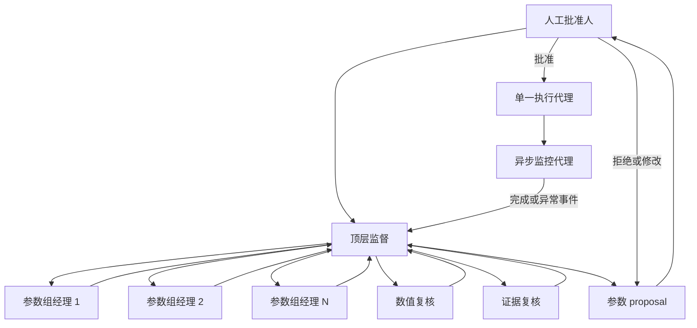
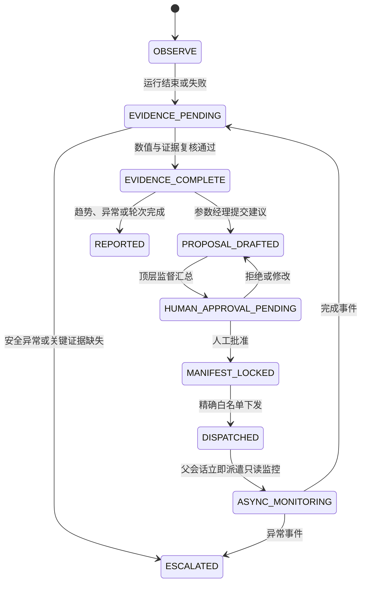

# 代理角色与状态机

上级：[通用治理规范](01_general_governance.md)
依赖：[证据复核与上报](04_evidence_and_reporting.md)
适用：T/S 通用；参数分组由设备手册定义

## 逻辑层级与实际派遣

子代理不应假定能够递归创建其他子代理。逻辑上的“顶层监督 → 参数经理 → 复核代理”由父会话实际并行派遣，父会话收齐所有结果后再综合。

参数经理只管理证据视图，不拥有 VM 槽位。所有经理共享一个 campaign 状态、一个原子 claim 边界和全局一核租约池。异步监控代理由父会话在每次成功下发后独立派遣，只拥有指定 `campaign_id` 的只读观察职责。

## 状态机

## 异步监控代理与自动续步

每次单一执行代理成功下发实验后，父会话必须立即派遣一个独立监控代理，避免父会话阻塞或依赖人工刷新。

1. 监控代理只读观察一个明确的 `campaign_id`，不得生成参数、重试、终止任务、启动 dispatcher 或修改运行状态。
2. PowerShell 观察循环使用 `Start-Sleep` 低频检查，不得忙轮询；默认间隔 60 秒，可依据单次求解时长延长。
3. 每轮同时核对本地 `status_manifest.json`、远端 campaign 进程和 atomic lease。单一状态文件不能证明完成。
4. 仅当无 `CLAIMED/RUNNING`、活动 lease 为 0，且批准白名单内全部候选进入明确终态时，向父会话返回完成事件。
5. 发现 lease/affinity、GZP/deck hash、端子偏置、10 mA 安全条件异常，或 dispatcher/runner 意外退出时，立即返回异常事件，不自动修复。
6. 父会话收到完成事件后负责真实 SVisual 提取、validation、scoring、数值与证据复核，再决定下一步；监控代理不代替数据处理和参数决策。
7. 父会话决定并成功下发已授权的下一步后，重复“派遣监控代理 → 完成/异常回报 → 父会话处理数据”的闭环。

“自动续步”只指父会话收到事件后继续编排上述闭环，不授予监控代理执行权，也不允许任何主体静默扩大 campaign 授权。

## 监控闭环

1. 参数经理读取本组状态，不修改运行。
2. 数值复核检查 solver、偏置、checkpoint、lease/affinity 和安全停止。
3. 证据复核检查 deck、mesh、manifest、SVisual CSV、validation、score 和 hash。
4. 顶层监督必须等待全部代理结果；缺少任一复核时保持 `EVIDENCE_PENDING`。
5. 只有本轮固定候选全部终态且无活动租约，才允许形成下一轮 proposal。
6. 新实验下发后进入 `ASYNC_MONITORING`；监控完成不等于证据复核完成。
7. 禁止无有效 decision 的跨轮自动生成。有效 campaign authorization 的锁定白名单内，父会话可按批准动作续步下发，无需逐候选重复审批。

## 并发边界

参数分组用于分析，不用于启动多套 dispatcher。并发数量、保留核心和依赖图以 campaign 与 `sentaurus-core-policy.json` 为准；AI 不得以“有多个经理”为由扩大槽位。